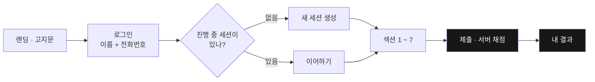
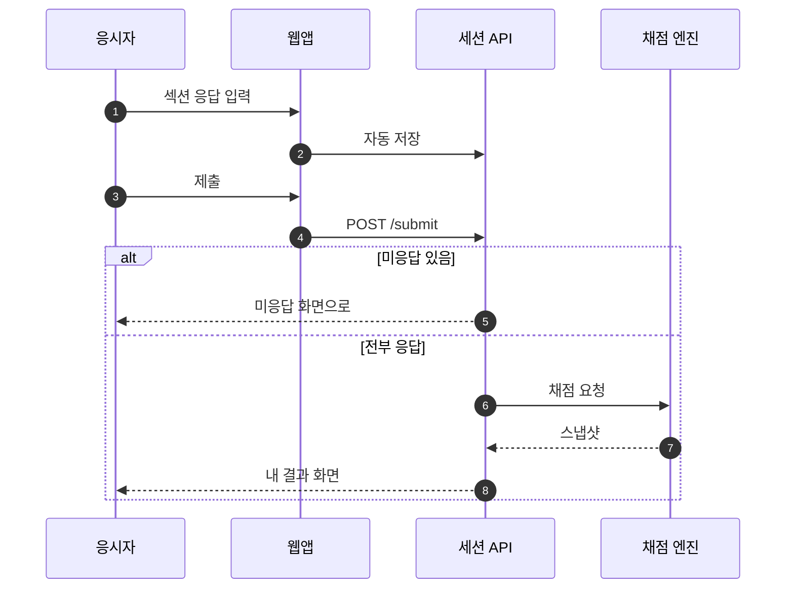

# 설계 문서 저장소

7차원 진단 설문 시스템의 설계·보고 문서입니다.

| 문서 | 내용 |
|---|---|
| [docs/00_설계_작업본.md](docs/00_설계_작업본.md) | 설계 작업본 |
| [docs/01_기능_UX_설계.md](docs/01_기능_UX_설계.md) | 기능 · UX 설계 |
| [docs/02_다이어그램_샘플.md](docs/02_다이어그램_샘플.md) | **다이어그램 모음 (렌더링 확인용)** |
| [docs/03_보고자료_소재모음.md](docs/03_보고자료_소재모음.md) | 보고자료 소재 |
| [docs/04_Mermaid_작성규칙.md](docs/04_Mermaid_작성규칙.md) | **Mermaid 작성 규칙 (사내 표준)** |

---

## 렌더링 확인

아래 두 블록이 **그림으로 보이면 성공**입니다. 코드 텍스트 그대로 보이면 Mermaid가 렌더되지 않는 것입니다.

### 1) GitHub이 쓰는 Mermaid 버전

이 블록은 렌더러의 버전을 그림으로 출력합니다. 여기 찍힌 번호가 우리가 쓸 수 있는 문법의 상한선입니다.

```mermaid
info
```

### 2) 한글 다이어그램



### 3) 역할별 흐름 (스윔레인 대용 시퀀스)



---

## 문서 검증

문서를 커밋하기 전에 Mermaid 블록이 깨지지 않는지 검사합니다.

```bash
cd tools && npm install    # 최초 1회
node tools/mermaid-lint.mjs docs README.md
```

파싱 오류뿐 아니라 **파싱은 되지만 잘못 렌더되는 경우**(예: `participant X as "이름"` — 따옴표가 그대로 찍힘)와
**GitHub에서 깨질 버전 비호환 문법**(`swimlane-beta`, `layout: elk`, icon/img 셰이프 등)까지 잡아냅니다.

자세한 규칙은 [docs/04_Mermaid_작성규칙.md](docs/04_Mermaid_작성규칙.md) 참고.
