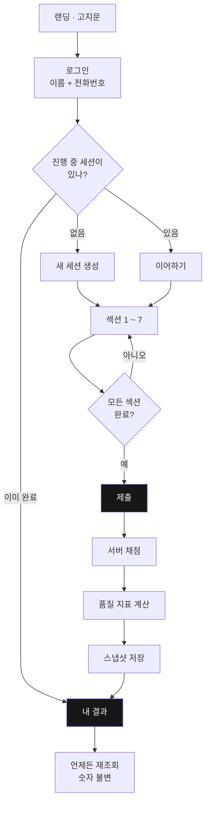
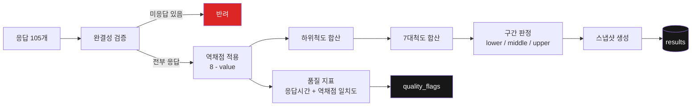
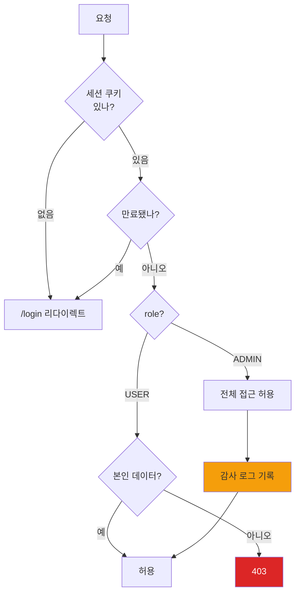
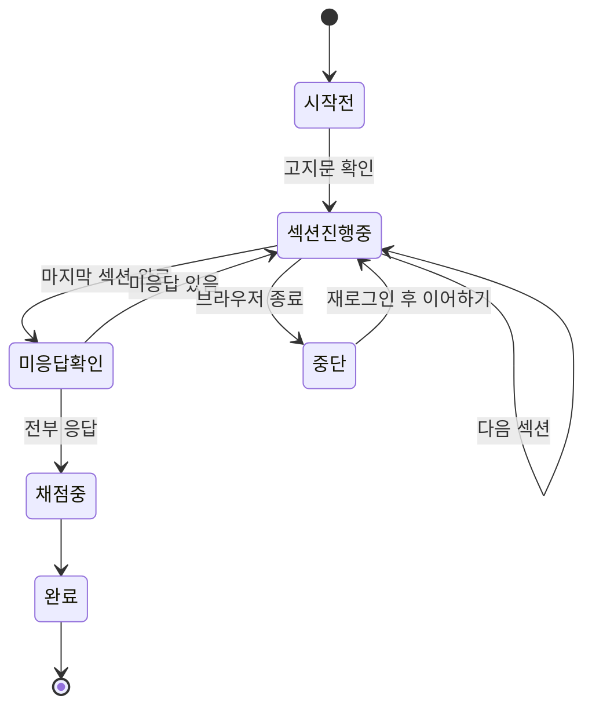
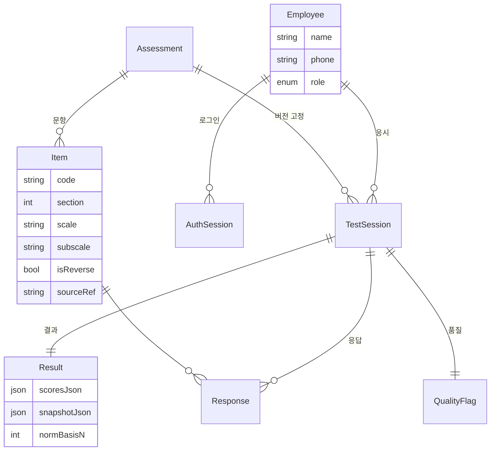
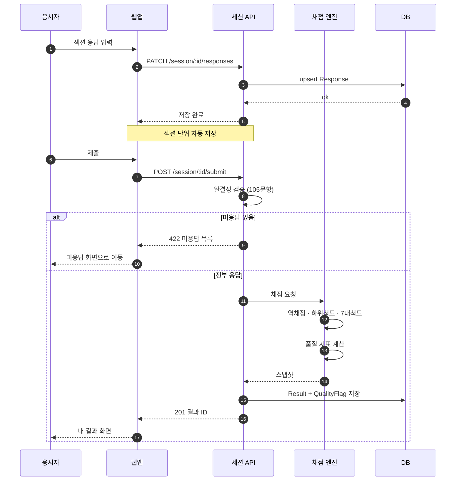
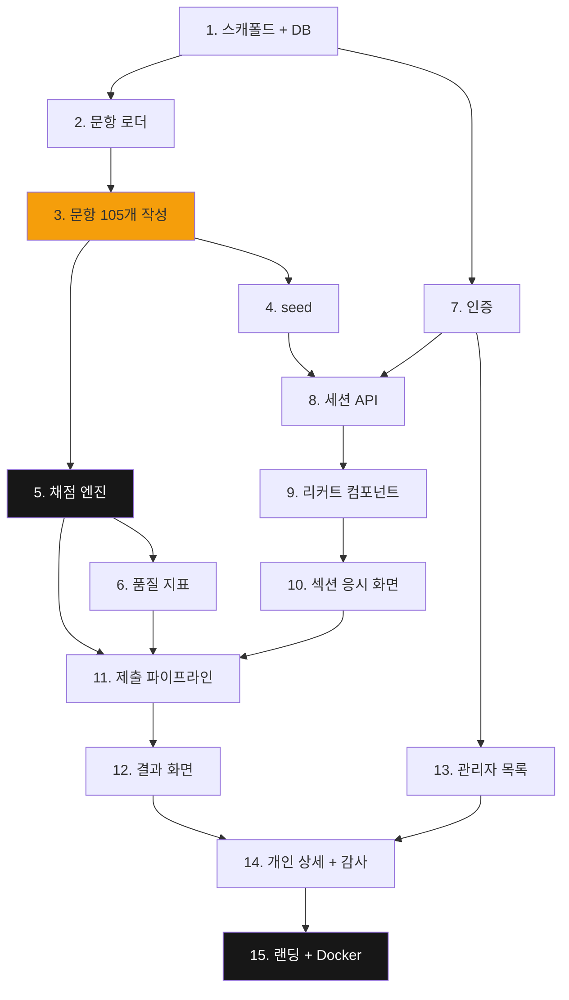

# 다이어그램 샘플 — 렌더링 확인용

> 이 파일은 **Mermaid 다이어그램이 보이는지 확인**하기 위한 것입니다.
> 아래 블록이 그림으로 보이면 Mermaid를 쓸 수 있고, 코드 텍스트로 보이면 ASCII로 갑니다.
>
> **확인 방법**: VS Code에서 이 파일을 열고 `Ctrl+Shift+V` (미리보기). 또는 GitHub에 올려서 보기.
> VS Code 1.121부터는 확장 설치 없이 기본 지원됩니다. 그 이전 버전이면 `bierner.markdown-mermaid` 확장을 설치하세요.

---

## 0. 먼저 — 렌더러 버전 확인

아래 블록은 **렌더링하는 쪽의 Mermaid 버전을 그림으로 출력**합니다.
사내 GitHub에 이 파일을 올린 뒤 이 블록에 찍힌 번호를 확인하세요. 그 번호가 우리가 쓸 수 있는 문법의 상한선입니다.

```mermaid
info
```

| 확인된 버전 | 쓸 수 있는 것 |
|---|---|
| **11.16 이상** | `swimlane-beta` 포함 전부 |
| **11.0 ~ 11.15** | 아래 5종 + `block-beta`, `architecture-beta` |
| **10.x 이하** | 아래 5종만 (이 문서의 모든 다이어그램은 여기 해당) |

> 이 문서의 다이어그램은 전부 **mermaid 10.9.8과 11.17.0 양쪽 파서에서 검증**되었습니다.
> 즉 사내 GitHub 버전이 무엇이든 깨지지 않습니다.

---

## 1. 전체 사용자 흐름



---

## 2. 채점 파이프라인



---

## 3. 권한 분기



---

## 4. 응시 화면 상태 머신



---

## 5. 데이터 모델 관계



---

## 6. 응시 · 제출 시퀀스

> 역할별로 "누가 무엇을 하는가"를 보여줍니다. 스윔레인 대신 쓰는 표준 방식입니다 (아래 부록 참고).



---

## 7. 구현 순서 (계획 문서의 15개 태스크)



> 주황색 = 콘텐츠 작업 (사람 검토 필요) · 검정 = 핵심 검증 지점

---

## ASCII 대안

Mermaid가 안 보이면 이런 식으로 대체합니다. 어디서든 보이지만 표현력은 낮습니다.

```
로그인
  │
  ├─ 진행 중 세션 없음 ──→ 새 세션 ──┐
  ├─ 진행 중 세션 있음 ──→ 이어하기 ─┼──→ 섹션 1~7 ──→ 제출
  └─ 이미 완료 ─────────────────────┼───────────────────┐
                                     │                    ▼
                                     └──────────────→ 내 결과
```

> 한글은 글자 폭 계산이 어긋나기 쉬우므로 ASCII 아트는 **아주 단순한 구조에만** 쓰세요.
