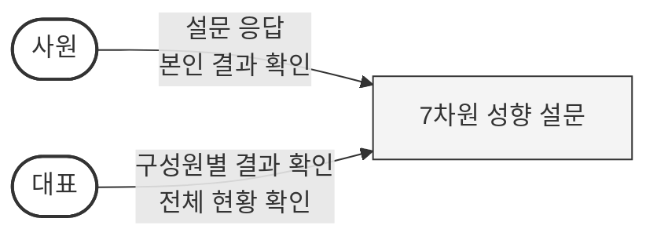
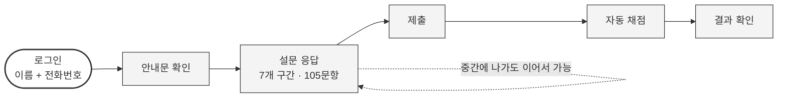
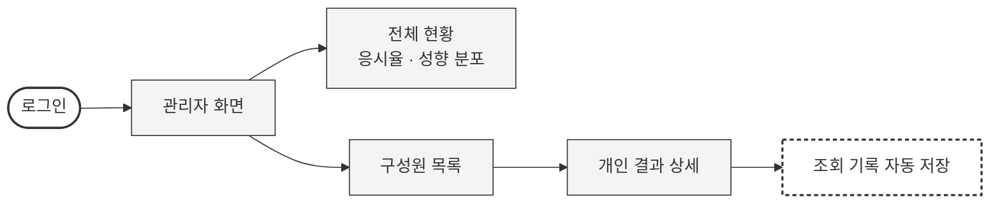
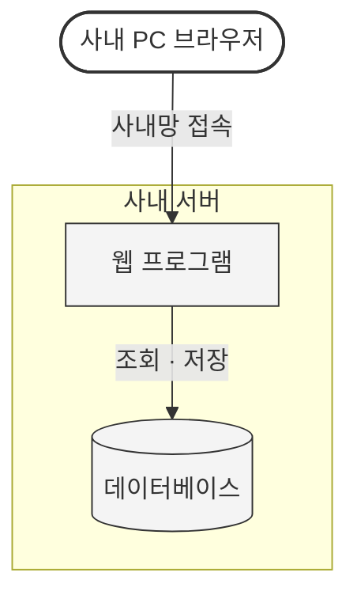
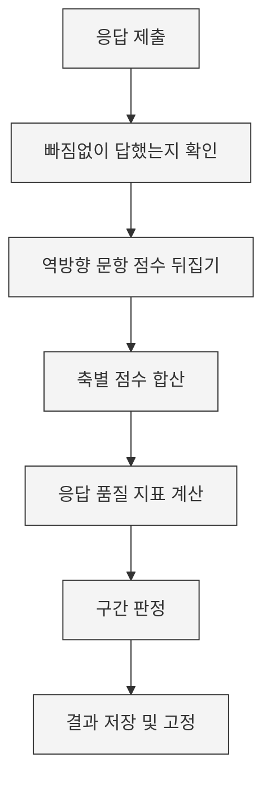

# 7차원 성향 설문 시스템 — 검토 보고

| 문서 상태 | 검토용 초안 (개발 착수 전) |
|---|---|
| 최종 수정 | 2026-08-21 |
| 구성 | **1부 요약** — 대표님용 (2쪽) · **2부 상세** — 담당자용 |

---

# 1부. 요약

## 이게 무엇인가

구성원이 웹에서 성향 설문에 답하면, **본인은 자기 결과를 보고 대표님은 구성원별 결과를 확인할 수 있는** 사내 전용 도구입니다.

| | |
|---|---|
| 소요 시간 | 약 15분 (105문항) |
| 대상 | 전 직원 (50명 이내) |
| 어디서 | 사내 서버. 외부 인터넷 서비스를 쓰지 않음 |
| 비용 | 자체 개발·자체 서버라 외부 지출 없음 |
| 응시 횟수 | 1인 1회 |

## 누가 무엇을 할 수 있나

| | 사원 | 대표 |
|---|:---:|:---:|
| 설문 응답 | O | O |
| **본인** 결과 보기 | O | O |
| **타인** 결과 보기 | **X** | O |
| 전체 현황·분포 보기 | X | O |

**대표님이 구성원 결과를 열람하면 기록이 남습니다.** 누가·언제·누구 결과를 봤는지 저장되며 지울 수 없습니다. 이건 대표님을 감시하려는 게 아니라, **구성원에게 "함부로 보지 않는다"를 증명하는 장치**입니다. 이 사실을 응시 전에 구성원에게도 미리 알립니다.

## 무엇을 알 수 있나 — 7개 축

| 구분 | 축 | 보는 것 |
|---|---|---|
| **기질** (타고난 성향) | 자극추구 | 새로움에 끌리는 정도 |
| | 위험회피 | 걱정하고 조심하는 정도 |
| | 사회적 민감성 | 타인 반응에 영향받는 정도 |
| | 인내력 | 보상이 없어도 지속하는 힘 |
| **성격** (경험으로 형성) | 자율성 | 스스로 정하고 책임지는 정도 |
| | 연대감 | 타인을 수용하고 협력하는 정도 |
| | 자기초월 | 자기를 넘어선 의미·연결감 |

각 축을 점수와 그래프로 보여줍니다. **"당신은 OO형" 같은 유형 이름은 붙이지 않습니다** — 사내에 라벨이 한번 돌면 되돌릴 수 없기 때문입니다.

## 미리 아셔야 할 세 가지

**1. 공인된 심리검사가 아닙니다.**
직접 만든 도구입니다. 공개된 학술 자료에 근거해 만들지만, **인사평가·승진·배치의 근거로 쓸 수 없습니다.** 자기이해와 참고용입니다.

**2. 로그인이 간단한 만큼 허술합니다.**
이름과 전화번호만으로 로그인합니다. 편한 대신, **동료의 이름과 전화번호를 아는 사람은 그 사람인 척 로그인해 결과를 볼 수 있습니다.** 비밀번호를 도입하면 막을 수 있으나 간편함을 우선했습니다. 이 부분을 강화할지는 대표님 판단이 필요합니다.

**3. 초기에는 문항이 검증되지 않은 상태입니다.**
새로 만든 문항이라 처음 30명 정도는 검증 전 문항으로 응답하게 됩니다. 데이터가 쌓이면 품질을 확인해 개선합니다.

## 정해주셔야 할 것

| # | 항목 | 내용 |
|---|---|---|
| 1 | 로그인 방식 | 위 2번 한계를 감수할지, 비밀번호를 넣을지 |
| 2 | 개인정보 처리방침 | 이름·전화번호·성향 데이터를 다루므로 운영 전 필요 |
| 3 | 보관 기간·퇴사자 처리 | 퇴사자 데이터를 언제까지 둘지 |
| 4 | 응시를 의무로 할지 | 시스템은 규정하지 않음. 화면에 "필수" 표현도 없음 |

---
---

# 2부. 상세

> 여기부터는 실제로 어떻게 동작하고 무엇으로 만드는지에 대한 내용입니다.

## 1. 왜 기존 검사를 사서 쓰지 않는가

| | |
|---|---|
| 정식 TCI | 한국 판권이 (주)마음사랑에 있어 문항·결과지를 그대로 쓸 수 없음 |
| MBTI 등 | 유형 라벨링 방식이라 사내에서 "너는 OO형"으로 굳어질 위험 |
| 구글폼 등 설문 서비스 | 자동 채점·개인별 그래프·권한 분리가 안 되고, 데이터가 외부에 저장됨 |
| **자체 제작** | 공개 논문·공개 문항은행에 근거해 직접 작성. **문항별 출처를 시스템에 기록**해 근거를 남김 |

이론적 뿌리는 클로닝거(C. R. Cloninger)의 기질·성격 모델입니다. **이론과 학술 용어는 자유롭게 참고할 수 있고, 보호되는 것은 제품명과 실제 문항**입니다. 그래서 이름도 "TCI"를 쓰지 않고 `7차원 성향 설문`으로 정했습니다.

## 2. 설문 응답 기능

| 기능 | 어떻게 구현하나 |
|---|---|
| **7개 구간으로 나눠 제시** | 105문항을 한 번에 보여주면 지칩니다. 척도별로 7구간으로 나누고, **앞 구간을 짧게** 배치해 초반 진행이 빠르게 느껴지도록 합니다 |
| **이어하기** | 구간을 넘길 때마다 서버에 저장. 브라우저를 닫거나 다른 기기에서 들어와도 이어집니다 |
| **미응답 방지** | 구간을 넘길 때마다 검사. 105문항 다 답한 뒤 "3번이 비었습니다"라고 하면 찾으러 돌아가야 하므로 |
| **응답 척도** | 7단계(전혀 아니다 ~ 매우 그렇다), 전 항목에 글자 라벨 표기 |
| **경과 시간 표시 안 함** | 시간이 보이면 서두르게 되어 응답 품질이 떨어집니다 |

**응시 전 안내문이 응답 왜곡 대응의 핵심입니다.** 실명으로 답하고 대표님이 볼 수 있는 구조라 "좋아 보이게" 답하려는 경향이 생깁니다. 이건 기술로 막을 수 없어 문구로 대응합니다 — 인사평가에 쓰지 않는다는 점, 대표님 조회 시 기록이 남는다는 점, 평소 자신에 가까운 답을 골라달라는 점을 명시합니다.

## 3. 결과 확인 기능

| 기능 | 어떻게 구현하나 |
|---|---|
| **결과 표시** | 7개 축을 레이더 그래프 + 막대로. 점수는 만점 대비 %로 환산(축마다 문항 수가 달라 원점수는 직접 비교 불가) |
| **숫자가 안 바뀜** | 확정된 결과를 그대로 보관. 나중에 응시자가 늘어도 이미 본 사람의 숫자는 변하지 않습니다 |
| **척도 설명** | 축 이름 옆 아이콘을 누르면 "이 축이 무엇을 재는지" 설명이 뜹니다 |
| **사내 순위 미표시** | 개인 화면에는 "상위 몇 %" 같은 비교를 넣지 않습니다. 우열 인식을 만들지 않기 위해서입니다 |
| **세부 항목 미표시** | 각 축의 하위 항목 점수는 저장하되 개인에게 보여주지 않습니다 (아래 5장 참조) |

1차 버전은 **그래프와 점수까지만** 내고, 개인별 맞춤 해설 문구는 2차에 붙입니다.

## 4. 관리자 기능

| 화면 | 무엇을 하나 |
|---|---|
| **전체 현황** | 응시 완료·진행 중·미응시 인원. 축별 사내 평균과 **얼마나 갈리는지**(퍼짐 정도)까지 표시 — 평균만 보면 "다들 비슷한지, 사람마다 극과 극인지"를 알 수 없기 때문 |
| **구성원 목록** | 세 가지 보기 전환 — ① 전체를 작은 막대로 훑어보기 ② 특정 축 기준 높은 순·낮은 순 정렬 ③ 성향 조합별로 묶어보기 |
| **개인 결과 상세** | 사원이 보는 것과 동일한 결과 + 응답 품질 지표 + 세부 항목 점수 |
| **조회 기록** | 누가·언제·누구를 봤는지 목록. 관리자 본인도 확인 가능 |
| **데이터 내보내기** | 엑셀에서 볼 수 있는 파일로 저장. **전화번호는 넣지 않습니다** — 성향 분석에 불필요한 개인정보라서 |

**관리자 화면이 하지 않는 것** — "이 사람은 특이하다", "주의가 필요하다" 같은 판정은 넣지 않습니다. 집계·정렬·시각화까지만 합니다. 검증되지 않은 도구로 사람을 분류하는 기능을 시스템이 제공해서는 안 되기 때문입니다.

유일한 예외는 **응답 품질 표시**입니다. 이건 성격에 대한 판정이 아니라 "이 응답 데이터를 믿을 수 있는가"에 대한 것이고, 연구로 검증된 지표(응답 시간, 반대 문항 일치도)에 근거합니다.

## 5. 보안과 기록

### 저장하는 정보

| 저장함 | 저장 안 함 |
|---|---|
| 이름, 전화번호, 부서 | 주민등록번호, 주소, 이메일 |
| 문항별 응답, 응답 소요시간 | 비밀번호 (애초에 안 씀) |
| 축별 점수, 응시 일시 | |
| 관리자 조회 기록 | |

### 권한 처리 방식

**화면에서 버튼을 숨기는 것은 보안이 아닙니다.** 주소를 직접 입력해도 서버에서 권한을 확인해 차단합니다. 본인 결과를 부르는 통로에는 아예 "누구 것"이라는 값을 받지 않아, 다른 사람 것을 요청할 방법 자체가 없습니다.

### 로그인 한계 (1부 2번 항목의 상세)

이름+전화번호만 쓰는 방식은 **식별은 되지만 인증이 아닙니다.** 사내에서 이름·전화번호는 원래 비밀이 아니므로 동료 사칭이 구조적으로 가능합니다.

| 현재 완화 요소 | |
|---|---|
| 사내 서버 배포 | 외부에서 접근하기 어려움 |
| 조회 기록 | 관리자 열람은 전부 기록됨 |
| 반복 시도 차단 | 15분 내 10회 실패 시 자동 잠금 |

강화가 필요해지면 **로그인 부분만 교체**하도록 설계해 두었습니다(사번+비밀번호, 사내 계정 연동 등). 나머지는 손대지 않습니다.

## 6. 기술 구성

| 영역 | 선택 | 이유 |
|---|---|---|
| 웹 | Next.js + TypeScript | 화면과 서버 로직을 한 곳에서. 타입 검사로 채점 오류 사전 차단 |
| 데이터베이스 | PostgreSQL | 사내 자체 운영 가능, 라이선스 비용 없음 |
| 배포 | Docker | 서버 이관 시 환경 차이 문제 제거 |

**구현상 지키는 것 세 가지**

- **채점은 서버에서만** — 브라우저에서 계산하면 조작이 가능합니다
- **문항을 프로그램이 아닌 파일로 관리** — 문항을 고칠 때 프로그램을 안 건드려도 되고, 변경 이력이 남습니다
- **문항마다 근거 출처 기록** — 저작권 대응이 말로만 끝나지 않게

## 7. 한계 — 정직하게

결과 화면에도 같은 내용을 상시 표시합니다.

| 한계 | 내용 |
|---|---|
| **공인 검사가 아님** | 임상 진단이나 인사평가 근거로 사용 불가 |
| **문항이 검증 전** | 초기 약 30명은 미검증 문항으로 응답. 데이터가 쌓이면 문항 품질을 확인해 개선 |
| **점수 구간 기준이 임의** | "높다/낮다"를 가르는 경계값에 학술적 근거가 없습니다. 우리가 정한 값이며 이 사실을 결과 화면에 명시합니다 |
| **표본이 작음** | 50명 이내라 사내 평균·분포는 참고 수준. 30명 미만에서는 분포 표시를 비활성화 |
| **세부 항목은 신뢰도가 낮음** | 정식 검사조차 세부 항목 수준 해석은 신뢰하기 어렵다는 평가를 받습니다. 그래서 개인에게는 7개 축까지만 보여줍니다 |

**저작권 대응** — 정식 검사 문항 미사용, "TCI"·"기질 및 성격검사" 명칭 미사용, 문항마다 근거 출처 기록.

---

## 부록. 채점 처리 순서

**역방향 문항**은 "나는 걱정이 많다"의 반대편인 "나는 웬만해선 걱정하지 않는다" 같은 문항입니다. 같은 방향으로만 물으면 무의식적으로 한쪽에 치우쳐 답하게 되므로 섞어서 냅니다. 채점할 때 점수를 뒤집어야 하는데, **이게 뒤집히면 결과가 통째로 반대로 나오면서도 눈으로는 안 보입니다.** 그래서 채점 부분만 따로 떼어 손으로 계산한 정답표와 대조하는 검사를 만들어 둡니다.

---

*상세 설계는 `00_설계_작업본.md`와 `01_기능_UX_설계.md`에 있습니다.*
