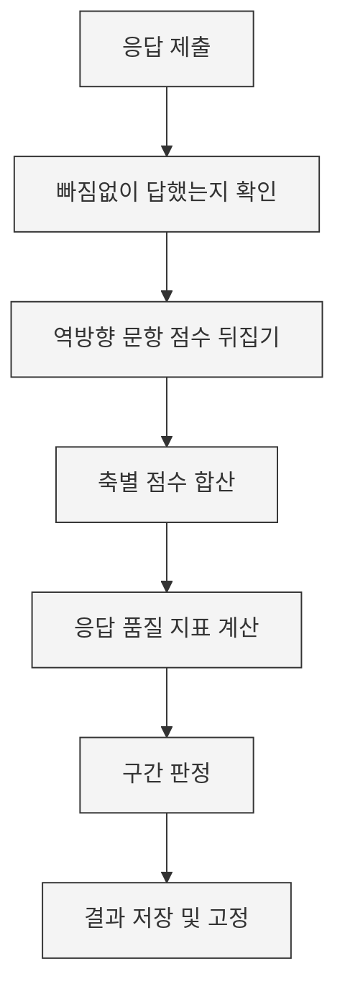

# 7차원 성향 설문 시스템 — 검토 보고

| 문서 상태 | 검토용 초안 (개발 착수 전) |
|---|---|
| 최종 수정 | 2026-08-21 |
| 구성 | **1부 요약** (1쪽) · **2부 상세** — 화면·동작·기술 |

---

# 1부. 요약

## 이렇게 만들려 합니다

| 규모 | 105문항 · 약 15분 · 전 직원 50명 이내 · 1인 1회 |
|---|---|
| 위치 | 사내 서버. 외부 인터넷 서비스를 쓰지 않음 |
| 비용 | 자체 개발·자체 서버라 외부 지출 없음 |
| 화면 | 총 11개 (사원 6 · 관리자 6, 일부 공용) |
| 현재 단계 | **설계 완료, 개발 착수 전** |

## 누가 무엇을 할 수 있나

| | 사원 | 대표 |
|---|:---:|:---:|
| 설문 응답 | O | O |
| **본인** 결과 보기 | O | O |
| **타인** 결과 보기 | **X** | O |
| 전체 현황·분포 보기 | X | O |

**대표님이 구성원 결과를 열람하면 기록이 남습니다.** 누가·언제·누구를 봤는지 저장되며 지울 수 없습니다. 대표님을 감시하려는 게 아니라 **구성원에게 "함부로 보지 않는다"를 증명하는 장치**이고, 이 사실을 응시 전에 구성원에게도 알립니다.

## 무엇을 알 수 있나

| 기질 (타고난 성향) | 성격 (경험으로 형성) |
|---|---|
| **자극추구** — 새로움에 끌리는 정도 | **자율성** — 스스로 정하고 책임지는 정도 |
| **위험회피** — 걱정하고 조심하는 정도 | **연대감** — 타인을 수용하고 협력하는 정도 |
| **사회적 민감성** — 타인 반응에 영향받는 정도 | **자기초월** — 자기를 넘어선 의미·연결감 |
| **인내력** — 보상 없이도 지속하는 힘 | |

7개 축을 점수와 그래프로 보여줍니다. **"당신은 OO형" 같은 유형 이름은 붙이지 않습니다** — 사내에 라벨이 한번 돌면 되돌릴 수 없기 때문입니다.

## 아셔야 할 세 가지

| | |
|---|---|
| **공인 검사가 아님** | 직접 만든 도구입니다. **인사평가·승진·배치의 근거로 쓸 수 없습니다.** 자기이해 참고용 |
| **로그인이 간단한 만큼 허술함** | 이름+전화번호만 입력합니다. **동료의 이름·번호를 아는 사람은 그 사람인 척 로그인할 수 있습니다.** 비밀번호를 넣으면 막히지만 간편함을 우선했습니다 |
| **초기엔 문항이 미검증** | 새로 만든 문항이라 처음 30명 정도는 검증 전 문항으로 응답합니다. 데이터가 쌓이면 품질을 확인해 개선합니다 |

## 정해주셔야 할 것

| 1 | **로그인 방식** — 위 한계를 감수할지, 비밀번호를 넣을지 |
|---|---|
| 2 | **개인정보 처리방침** — 이름·전화번호·성향 데이터를 다루므로 운영 전 필요 |
| 3 | **보관 기간·퇴사자 처리** — 퇴사자 데이터를 언제까지 둘지 |
| 4 | **응시를 의무로 할지** — 시스템은 규정하지 않음. 화면에 "필수" 표현도 없음 |

---
---

# 2부. 상세

## 1. 전체 화면 구성

웹사이트는 화면 11개로 이루어집니다.

| 구분 | 화면 | 하는 일 |
|---|---|---|
| **공통** | 첫 화면 | 검사 소개 + 고지문 |
| | 로그인 | 이름 + 전화번호 입력 |
| **사원** | 응시 시작 | 새로 시작 / 이어하기 판단 |
| | 응시 (7개) | 구간별 문항 응답 |
| | 제출 완료 | 채점 진행 표시 |
| | 내 결과 | 그래프 + 점수 |
| **관리자** | 대시보드 | 응시 현황 + 전체 성향 분포 |
| | 구성원 목록 | 3가지 보기 전환 |
| | 개인 결과 상세 | 개인별 결과 + 응답 품질 |
| | 조회 기록 | 누가 누구를 봤는지 + 구성원 추가 |
| | 통계 | 축별 분포 상세 |
| | 문항 목록 | 현재 문항과 근거 출처 (읽기 전용) |

사원에게는 관리자 화면으로 가는 통로가 아예 보이지 않고, 주소를 직접 입력해도 서버에서 차단합니다.

---

## 2. 사원이 쓰는 화면

### 2-1. 첫 화면 — 응답 왜곡 대응이 실제로 일어나는 곳

실명으로 답하고 대표님이 볼 수 있는 구조라 **"좋아 보이게" 답하려는 경향**이 생깁니다. 이건 기술로 막을 수 없어 **문구로 대응**합니다.

```
┌────────────────────────────────────────────┐
│   7차원 성향 설문 안내                      │
│                                            │
│   ▸ 약 15분 소요, 105문항                   │
│   ▸ 중간에 그만두어도 이어서 하실 수 있습니다 │
│   ────────────────────────────────────     │
│   이 검사는 무엇에 쓰이나요                  │
│   • 구성원의 자기이해를 돕기 위한 자료입니다  │
│   • 인사평가, 승진, 배치의 근거로            │
│     사용되지 않습니다                        │
│   • 관리자는 결과를 조회할 수 있으며,        │
│     조회 기록이 남습니다                     │
│   ────────────────────────────────────     │
│   정확한 결과를 위해                         │
│   • 좋아 보이는 답이 아니라 평소 자신에      │
│     가까운 답을 골라주세요                   │
│   • 정답과 오답이 없습니다                   │
│   • 오래 고민하지 말고 첫 느낌으로 답해주세요 │
│                                            │
│            [ 검사 시작하기 ]                 │
└────────────────────────────────────────────┘
```

**"관리자가 조회할 수 있다"를 숨기지 않는 이유** — 숨겨도 어차피 알게 되고, 그때의 불신이 훨씬 큽니다. 연구상 응답 왜곡의 크기는 "응시자가 결과의 영향을 어떻게 믿는가"에 좌우되므로, 용도를 명확히 밝히는 쪽이 왜곡을 줄입니다.

이 화면에서 **"검사 시작하기"를 누른 시각이 곧 고지문을 확인했다는 기록**이 됩니다. 별도 동의 체크박스를 두지 않습니다.

### 2-2. 응시 화면 — 이 시스템에서 가장 공들인 부분

105문항을 한 번에 늘어놓으면 지쳐서 대충 답하게 됩니다. 아래 방식으로 대응합니다.

```
┌──────────────────────────────────────────────────┐
│ ████████████░░░░░░░░░░░░░░░░░░░░░░  섹션 3 / 7   │  ← 상단 고정
└──────────────────────────────────────────────────┘
             사회적 민감성 · 15문항 중 7번째

  (흐림)  나는 처음 만난 사람과도 쉽게 대화한다
          ○ ○ ○ ○ ○ ● ○

  (진하게) 나는 다른 사람의 기분 변화를 잘 알아챈다

          ○      ○      ○     ○     ○      ○      ○
        전혀   아니다  약간   보통  약간  그렇다  매우
        아니다        아니다      그렇다        그렇다

  (흐림)  나는 혼자 있는 시간이 편하다
          ○ ○ ○ ○ ○ ○ ○
```

| 방식 | 왜 이렇게 하나 |
|---|---|
| **7개 구간으로 분할** | 척도별로 나눕니다. 한 구간이 끝날 때마다 "3/7 완료"가 보여 진행감이 생깁니다 |
| **앞 구간을 짧게 배치** | 12 → 13 → 15 → 15 → 16 → 17 → 17문항. 초반이 빨리 차오르면 이탈이 줄어든다는 연구 결과를 따랐습니다. 문항 수를 조작해 가짜로 빠르게 보이게 하는 게 아니라 **실제로 앞을 짧게** 만듭니다 |
| **답할 문항만 진하게** | 나머지는 흐리게 처리. 답하면 그 줄이 흐려지고 다음 문항이 진해지며 부드럽게 스크롤됩니다. "한 번에 한 문항"의 집중력과 "스크롤 목록"의 속도를 동시에 가져갑니다 |
| **7단계 + 전 항목 글자 라벨** | 숫자만 있으면 가운데 항목의 의미가 모호해집니다. 양극 척도는 7단계가 적정하다는 문헌 근거를 따랐습니다 |
| **경과 시간 미표시** | 시간이 보이면 서두르게 되어 응답 품질이 떨어집니다 |
| **미응답 즉시 확인** | 구간을 넘길 때마다 검사합니다. 105문항 다 답한 뒤 "3번이 비었습니다"라고 하면 찾으러 돌아가야 합니다 |

**이어하기** — 구간을 넘길 때마다 서버에 저장하고, 문항 하나하나는 브라우저에도 즉시 저장합니다. 브라우저를 닫거나 다른 기기에서 들어와도 이어집니다. 30일 넘게 방치된 응시는 자동으로 정리되어 새로 시작하게 됩니다.

**색으로만 구분하지 않습니다** — 선택 상태를 색·굵기·체크표시 세 가지로 동시에 표현합니다. 색각 이상이 있는 분(남성 약 8%)도 문제없이 응답할 수 있어야 하기 때문입니다.

### 2-3. 결과 화면

```
┌──────────────────────────────────────────────────┐
│  ○○○ 님의 검사 결과                              │
│  2026-08-21 기준 · 소요 14분                     │
├──────────────────────────────────────────────────┤
│              [ 레이더 그래프 ]                    │
│                   자극추구                        │
│           자기초월  ╱  ╲  위험회피                 │
│                ╲  ╱    ╲  ╱                      │
│            연대감 ╲    ╱ 사회적민감성              │
│                   ╲  ╱                           │
│              자율성    인내력                      │
├──────────────────────────────────────────────────┤
│  축별 점수                                        │
│  자극추구      ⓘ ████████████░░░░░░  62%         │
│  위험회피      ⓘ ██████░░░░░░░░░░░░  34%         │
│  사회적 민감성 ⓘ ███████████████░░░  78%         │
│  ...                                             │
│   ※ ⓘ 를 누르면 그 축이 무엇을 재는지 설명이 뜹니다 │
├──────────────────────────────────────────────────┤
│  ⚠ 이 결과는 사내 자체 제작 도구의 결과이며       │
│    공인 심리검사가 아닙니다. 점수 구간의 구분      │
│    기준도 사내에서 임의로 정한 것입니다.           │
└──────────────────────────────────────────────────┘
```

| 항목 | 처리 |
|---|---|
| **그래프 두 종류** | 레이더는 전체 모양을 한눈에, 막대는 축 간 비교를 위해. 레이더만으로는 어느 축이 더 높은지 정확히 읽기 어렵습니다 |
| **점수는 만점 대비 %** | 축마다 문항 수가 달라(12~17개) 원점수를 직접 비교할 수 없습니다 |
| **숫자가 나중에 안 바뀜** | 확정된 결과를 그대로 보관합니다. 응시자가 늘어도 이미 본 사람의 숫자는 변하지 않습니다 |
| **사내 순위 미표시** | "상위 몇 %" 같은 비교를 개인 화면에 넣지 않습니다. 우열 인식을 만들지 않기 위해서입니다 |
| **세부 항목 미표시** | 각 축의 하위 항목 점수는 저장하되 개인에게는 보여주지 않습니다 (7장 참조) |
| **재검사 버튼 없음** | 1회 응시 원칙. 결과는 언제든 다시 볼 수 있습니다 |

**1차 버전은 그래프·점수·축 설명까지 냅니다.** 개인 점수에 맞춘 맞춤 해설 문구는 2차에 붙입니다. 미리 붙이면 검증되지 않은 문항 위에 해석까지 얹는 셈이 되어, 숫자보다 위험합니다.

---

## 3. 관리자가 쓰는 화면

관리자 화면은 **집계·정렬·시각화까지만** 합니다. "이 사람은 특이하다", "주의가 필요하다" 같은 판정 기능은 넣지 않습니다 — 검증되지 않은 도구로 사람을 분류하는 기능을 시스템이 제공해서는 안 되기 때문입니다.

### 3-1. 대시보드 — 전체가 어떤가

```
┌──────────────┬──────────────┬──────────────┬────────┐
│  전체 인원    │  응시 완료   │  진행 중     │ 미응시 │
│     42       │   28 (67%)   │      5       │   9    │
└──────────────┴──────────────┴──────────────┴────────┘

┌─────────────────────────────────────────────────────┐
│  전체 성향 분포                                      │
│         평균 프로파일          축별 퍼짐 정도        │
│            자극추구         자극추구 ├──▓▓▓▓▓──┤ 54  │
│                             위험회피 ├─▓▓▓──────┤ 41 ◀좁│
│         [레이더 그래프]     사회민감 ├───▓▓▓▓▓▓─┤ 61  │
│                             인내력   ├──▓▓▓▓▓▓──┤ 63  │
│                             자율성   ├────▓▓▓▓──┤ 68  │
│                             연대감   ├───▓▓▓▓▓──┤ 71  │
│                             자기초월 ├─▓▓▓▓▓▓▓▓─┤ 47 ◀넓│
│  ▓ = 응답자 대부분이 분포한 구간                     │
└─────────────────────────────────────────────────────┘
```

**평균만 보여주지 않고 "퍼짐 정도"를 함께 보여주는 이유** — 위험회피 41과 자기초월 47은 숫자가 비슷하지만, 위험회피는 다들 비슷하게 답했고 자기초월은 사람마다 극과 극입니다. 대표님이 알고 싶은 "우리 회사가 어떤 성향이냐"의 답은 평균이 아니라 **어디가 모여 있고 어디가 갈리느냐**에 있습니다.

**검사 품질 카드** — 응답이 30건 이상 쌓이면 축별 신뢰도 지표가 자동으로 활성화됩니다. 자체 제작 검사라 신뢰도가 미지수인데, 이 카드가 없으면 문제를 영영 모릅니다.

### 3-2. 구성원 목록 — 세 가지 보기

한 화면에서 관점만 바꿉니다. 화면을 여러 개로 나누면 어디서 뭘 보는지 기억해야 하고 매번 이동해야 합니다.

**보기 1. 훑어보기** — 42줄짜리 숫자표는 읽히지 않지만, 작은 막대는 위아래로 훑으면 패턴이 눈에 들어옵니다.

```
┌───────┬──────┬────────┬────────────────────────┬────┐
│ 이름  │ 상태 │ 응시일 │ 자극 위험 사회 인내 ... │품질│
├───────┼──────┼────────┼────────────────────────┼────┤
│ 김○○ │ 완료 │ 08-14  │ ▆▆   ▃    ▇▇   ▅▅      │ ✓  │
│ 이○○ │ 완료 │ 08-15  │ ▃    ▇▇   ▄    ▆▆      │ ✓  │
│ 박○○ │ 완료 │ 08-15  │ ▇▇   ▅▅   ▄    ▇▇      │ ⚠  │
│ 최○○ │미응시│   —    │  —                     │ —  │
└───────┴──────┴────────┴────────────────────────┴────┘
```

축 이름을 누르면 그 축 기준으로 정렬됩니다. **"자극추구 높은 순"으로 정렬하면 위쪽이 곧 그 성향이 두드러진 사람들**입니다.

**보기 2. 사내 분포에서의 위치** — 특정 축을 골라 분포와 순서를 봅니다.

```
┌──────────────────────────────────────────────────────────┐
│  기준 축  [ 자극추구 ▾ ]           ⓘ n=28 기준. 참고용     │
│  분포        ▁▂▅█▇▄▂▁                                    │
│              20  40  60  80  100                         │
│              평균 54.2 · 표준편차 12.8                    │
│  ────────────────────────────────────────                │
│  이 축 점수가 높은 순                                     │
│    박○○ 81 · 정○○ 78 · 김○○ 71 ...                     │
│  이 축 점수가 낮은 순                                     │
│    한○○ 22 · 오○○ 27 · 이○○ 31 ...                     │
└──────────────────────────────────────────────────────────┘
```

순위 번호(1위/2위)는 붙이지 않고 점수순 나열만 합니다. 응시자가 30명 미만이면 평균·분포 표시는 비활성화됩니다 — 표본이 작으면 평균 자체가 불안정하기 때문입니다.

**보기 3. 유형별** — 성향 조합이 비슷한 사람끼리 묶어 봅니다.

```
┌────────────────┬────────────────┬────────────────┐
│ 자극↑ 위험↓ 사회↑│ 자극↑ 위험↓ 사회↓│ 자극↑ 위험↑ 사회↑│
│ 6명            │ 3명            │ 4명            │
│ 김○○ 이○○ …   │ 박○○ 최○○ …   │ 정○○ …        │
└────────────────┴────────────────┴────────────────┘
        ⓘ 훑어보기용입니다. 통계가 아닙니다.
```

**유형에 이름을 붙이지 않습니다.** 조합 표기만 씁니다. 50명이면 칸당 5~6명이라 "영업팀은 이 유형이 많다" 같은 결론을 내면 안 되는 표본이고, 그 안내를 화면에 상시 노출합니다.

### 3-3. 개인 결과 상세

```
┌─────────────────────────────────────────────────┐
│  ← 목록으로                          [응시 초기화]│
│  김○○ · 2026-08-14 응시 · 소요 16분             │
│  ⓘ 이 화면 조회 기록이 저장되었습니다             │
├─────────────────────────────────────────────────┤
│  [사원이 보는 것과 동일한 그래프 + 점수]          │
├─────────────────────────────────────────────────┤
│  관리자 전용 정보                                 │
│  응답 품질     정상                              │
│    평균 응답시간   4.2초/문항                     │
│    반대 문항 일치도 0.81                          │
│    응답 변경 횟수  6회                            │
│  사내 분포 대비 위치  (n=32, 참고용)              │
│    자극추구 상위 34%  위험회피 상위 61%  ...      │
└─────────────────────────────────────────────────┘
```

| 항목 | 설명 |
|---|---|
| **응답 품질** | 성실하게 답했는지를 봅니다. ① 문항당 응답 시간이 지나치게 짧은지 ② 서로 반대여야 정상인 문항 쌍에 같은 방향으로 답했는지. **성격 판정이 아니라 데이터 신뢰도 판정**입니다 |
| **사내 분포 대비 위치** | 관리자 화면에만 있습니다. 개인 화면에는 절대 표시하지 않습니다 |
| **응시 초기화** | 아무렇게나 찍고 제출한 경우의 구제용입니다. 확인 창을 거쳐야 하고, 초기화했다는 사실이 기록에 남습니다. 사원 화면에는 이 기능이 없습니다 |

### 3-4. 조회 기록

```
┌──────────────────────────────────────────────────────┐
│  등록 42명 │ 응시 완료 28명 (67%) │ [+ 구성원 추가]  │
├───────────────┬──────────┬──────────┬───────────────┤
│ 시각           │ 조회자    │ 대상      │ 동작          │
├───────────────┼──────────┼──────────┼───────────────┤
│ 08-20 14:32   │ 관리자김  │ 이철수    │ 개인 결과 조회 │
│ 08-20 11:05   │ 관리자김  │ 박영희    │ 개인 결과 조회 │
│ 08-19 09:12   │ 관리자김  │ —         │ 구성원 추가    │
└───────────────┴──────────┴──────────┴───────────────┘
```

기록에 남는 것: **개인 결과 조회 · 데이터 내보내기 · 구성원 추가 · 응시 초기화.** 삭제할 수 없습니다.

---

## 4. 로그인과 계정

이름과 전화번호만 입력합니다. 별도 가입 절차가 없어 **처음 들어온 사람도 입력만 하면 그 자리에서 계정이 만들어집니다.**

| 얻는 것 | 감수하는 것 |
|---|---|
| 관리자가 사전에 명단을 준비할 필요 없음 | 오타로 잘못 입력하면 다른 계정이 생김 |
| 신규 입사자가 와도 별도 작업 없음 | 로그인 화면에 닿으면 아무 이름이나 등록 가능 |

**오타 계정 대응** — 사전 차단 대신 사후 정리로 갑니다. 관리자 화면에 등록 인원과 미응시자가 보이므로 오타 계정은 목록에서 눈에 띕니다. 50명 이내 규모에서는 이 방식으로 충분합니다.

**전화번호 표기 통일** — `010-1234-5678`과 `01012345678`을 같은 것으로 처리합니다. 이게 안 되면 하이픈 유무 때문에 같은 사람이 로그인하지 못하는 일이 생깁니다.

**반복 시도 차단** — 같은 이름·번호 조합으로 15분 내 10회 실패하면 자동으로 잠기고 15분 뒤 풀립니다. 사무실이 같은 인터넷 주소를 쓰므로 주소 기준이 아니라 **이름·번호 조합 기준**으로 막습니다. 주소 기준이면 한 사람이 여러 번 틀렸다고 사무실 전체가 로그인 못 하게 됩니다.

---

## 5. 채점이 어떻게 이뤄지나



**역방향 문항이란** — "나는 걱정이 많다"의 반대편인 "나는 웬만해선 걱정하지 않는다" 같은 문항입니다. 같은 방향으로만 물으면 무의식적으로 한쪽에 치우쳐 답하게 되므로 30~40% 비율로 섞습니다. 채점할 때 점수를 뒤집어야 하는데, **이게 뒤집히면 결과가 통째로 반대로 나오면서도 눈으로는 안 보입니다.**

그래서 채점 부분만 따로 떼어내 데이터베이스 없이 단독으로 검사할 수 있게 만들고, **손으로 계산한 정답표와 대조하는 자동 검사**를 붙입니다.

**채점은 서버에서만 합니다.** 브라우저에서 계산하면 조작이 가능합니다.

**구간 판정 기준** — "높다/중간이다/낮다"를 가르는 경계값은 **이 프로젝트에서 유일하게 학술 근거 없이 우리가 정하는 값**입니다. 정식 검사는 수천 명 표본으로 환산표를 만들지만 우리는 문항을 새로 썼기 때문에 그 자료가 없습니다. 현재 50%/65%로 잡았고, 응답이 30건 쌓이면 실제 분포를 보고 조정합니다. **이 사실을 결과 화면에서 숨기지 않습니다.**

---

## 6. 데이터와 권한

### 저장하는 정보

| 저장함 | 저장 안 함 |
|---|---|
| 이름, 전화번호, 부서 | 주민등록번호, 주소, 이메일 |
| 문항별 응답, 응답 소요시간 | 비밀번호 (애초에 안 씀) |
| 축별 점수, 응시 일시 | |
| 관리자 조회 기록 | |

**내보내기 파일에는 전화번호를 넣지 않습니다** — 성향 분석에 불필요한 개인정보입니다.

### 권한 처리 방식

**화면에서 버튼을 숨기는 것은 보안이 아닙니다.** 주소를 직접 입력해도 서버에서 권한을 확인해 차단합니다. 본인 결과를 부르는 통로에는 아예 "누구 것"이라는 값을 받지 않아, 다른 사람 것을 요청할 방법 자체가 없습니다.

### 로그인 한계 (1부 항목의 상세)

이름+전화번호는 **식별은 되지만 인증이 아닙니다.** 사내에서 이름·전화번호는 원래 비밀이 아니므로 동료 사칭이 구조적으로 가능합니다. 비밀번호나 개인 PIN을 넣으면 막을 수 있으나 간편함을 우선했습니다.

현재 완화 요소는 ① 사내 서버 배포라 외부 접근이 어려움 ② 관리자 열람은 전부 기록됨 ③ 반복 시도 차단, 이 세 가지입니다.

강화가 필요해지면 **로그인 부분만 교체**하도록 설계해 두었습니다(사번+비밀번호, 사내 계정 연동 등). 나머지 코드는 손대지 않습니다.

---

## 7. 무엇으로 만드나

| 영역 | 선택 | 이유 |
|---|---|---|
| 웹 | Next.js + TypeScript | 화면과 서버 로직을 한 곳에서. 타입 검사로 채점 오류 사전 차단 |
| 데이터베이스 | PostgreSQL | 사내 자체 운영 가능, 라이선스 비용 없음 |
| 배포 | Docker | 서버 이관 시 환경 차이 문제 제거. 명령 한 번으로 기동 |

**사내 서버에 프로그램 하나와 데이터베이스 하나가 돌고, 사내망 PC에서 브라우저로 접속합니다.** 외부와 주고받는 것이 없습니다.

**화면 폭 대응** — PC 기준으로 만들되 고정 폭을 쓰지 않습니다. 1920 해상도 노트북이라도 Windows 배율이 150%면 브라우저가 보는 실제 폭은 1280입니다. 그래서 설계 하한을 1024로 잡습니다. 모바일은 후순위지만 지금 구조를 열어두어 나중에 싸게 붙일 수 있게 합니다.

**문항을 프로그램이 아닌 파일로 관리합니다.** 문항을 고칠 때 프로그램을 안 건드려도 되고 변경 이력이 남습니다. **문항마다 근거 출처를 함께 기록**해 저작권 대응이 말로만 끝나지 않게 합니다.

---

## 8. 왜 기존 검사를 쓰지 않는가

| | |
|---|---|
| 정식 TCI | 한국 판권이 (주)마음사랑에 있어 문항·결과지를 그대로 쓸 수 없음 |
| MBTI 등 | 유형 라벨링 방식이라 사내에서 "너는 OO형"으로 굳어질 위험 |
| 구글폼 등 설문 서비스 | 자동 채점·개인별 그래프·권한 분리가 안 되고, 데이터가 외부에 저장됨 |
| 엑셀 배포 | 취합·채점을 수작업으로 해야 하고, 누가 봤는지 추적 불가 |
| **자체 제작** | 공개 논문·공개 문항은행에 근거해 직접 작성. 문항별 출처를 기록해 근거를 남김 |

이론적 뿌리는 클로닝거(C. R. Cloninger)의 기질·성격 모델입니다. **이론과 학술 용어는 자유롭게 참고할 수 있고, 보호되는 것은 제품명과 실제 문항**입니다. 그래서 이름도 "TCI"를 쓰지 않고 `7차원 성향 설문`으로 정했습니다.

---

## 9. 한계 — 정직하게

결과 화면에도 같은 내용을 상시 표시합니다.

| 한계 | 내용 |
|---|---|
| **공인 검사가 아님** | 임상 진단이나 인사평가 근거로 사용 불가 |
| **문항이 검증 전** | 초기 약 30명은 미검증 문항으로 응답. 별도 사전 검증 집단을 두면 50명 중 30명을 써버려 본 검사에 남는 표본이 없어집니다. 그래서 **운영하면서 검증**하고, 신뢰도가 낮은 축의 문항을 교체합니다 |
| **점수 구간 기준이 임의** | 5장 참조. 우리가 정한 값이며 이 사실을 결과 화면에 명시합니다 |
| **표본이 작음** | 50명 이내라 사내 평균·분포는 참고 수준. 30명 미만에서는 분포 표시를 비활성화 |
| **세부 항목은 신뢰도가 낮음** | 정식 검사조차 세부 항목 수준 해석은 "제한적 유용성"이라는 평가를 받습니다. 그래서 개인에게는 7개 축까지만 보여주고, 세부 항목은 문항 개선용으로만 씁니다 |
| **부서별 비교 불가** | 부서당 5~10명이면 통계가 성립하지 않고, 소수 부서는 필터 자체가 개인 식별이 됩니다. 기능에서 제외했습니다 |

**문항 개정 시에도 재응시를 요구하지 않습니다.** 기존 응시자의 결과는 그대로 유지되고, 개정 이후 응시자만 새 문항으로 채점됩니다. 관리자 화면에서 어느 버전으로 응시했는지 구분해 볼 수 있습니다.

---

*상세 설계는 `00_설계_작업본.md`와 `01_기능_UX_설계.md`에 있습니다.*
