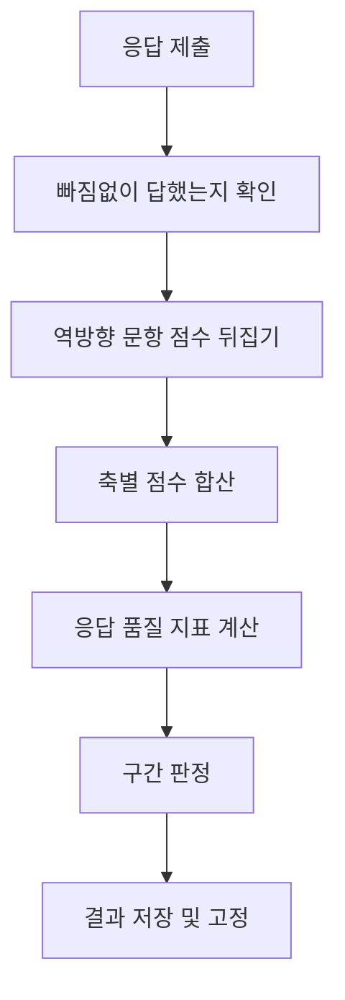

# 7차원 성향 설문 시스템 — 검토 보고

작성일 2026-08-21 · 개발 착수 전 검토용

---

# 1부. 요약

## 이렇게 만들려 합니다

구성원이 사내 웹사이트에서 105문항짜리 설문에 답하면, 본인은 자기 결과를 확인하고 대표님은 구성원별 결과와 전체 분포를 보실 수 있습니다. 응답 시간은 15분 안팎입니다.

사내 서버에서 돌아가며 외부 서비스는 쓰지 않습니다. 직접 만들고 회사 서버에 올리는 것이라 외부로 나가는 비용은 없습니다. 화면은 사원용과 관리자용을 합쳐 열한 개입니다.

현재 설계는 끝났고 개발은 아직 시작하지 않았습니다.

## 누가 무엇을 볼 수 있나

| | 사원 | 대표 |
|---|:---:|:---:|
| 설문 응답 | O | O |
| 본인 결과 보기 | O | O |
| **타인** 결과 보기 | **X** | O |
| 전체 현황·분포 보기 | X | O |

대표님이 특정 구성원의 결과를 열어보시면 그 기록이 남습니다. 누가 언제 누구 결과를 봤는지가 저장되고 지울 수 없습니다.

이 장치를 넣은 이유는 대표님을 감시하기 위해서가 아닙니다. 구성원 입장에서는 "내 성향 데이터를 누가 언제 들여다볼지 모른다"는 게 가장 큰 불안이고, 그 불안이 남아 있으면 다들 좋아 보이는 답만 고르게 됩니다. 조회 기록이 남는다는 사실을 미리 알려주는 것이 오히려 솔직한 응답을 끌어내는 데 도움이 됩니다.

## 무엇을 알 수 있나

일곱 개 축으로 나눠 봅니다. 앞의 네 개는 타고난 기질에 가깝고, 뒤의 세 개는 경험을 통해 형성되는 성격에 가깝습니다.

| 기질 | 성격 |
|---|---|
| **자극추구** — 새로움에 끌리는 정도 | **자율성** — 스스로 정하고 책임지는 정도 |
| **위험회피** — 걱정하고 조심하는 정도 | **연대감** — 타인을 수용하고 협력하는 정도 |
| **사회적 민감성** — 타인 반응에 영향받는 정도 | **자기초월** — 자기를 넘어선 의미·연결감 |
| **인내력** — 보상 없이도 지속하는 힘 | |

각 축을 점수와 그래프로 보여줍니다. 다만 "당신은 OO형입니다" 같은 유형 이름은 붙이지 않기로 했습니다. 사내에서 한 번 라벨이 돌기 시작하면 되돌릴 방법이 없기 때문입니다.

## 아셔야 할 세 가지

**첫째, 공인된 심리검사가 아닙니다.** 공개된 논문과 자료를 근거로 직접 만든 도구입니다. 자기이해를 돕는 참고 자료 수준으로 보시면 됩니다.

**둘째, 로그인은 이름과 전화번호로 합니다.** 따로 가입하거나 비밀번호를 만들 필요가 없습니다. 다음에 같은 이름과 번호로 들어오면 예전에 받은 결과가 그대로 나오고, 원하면 거기서 다시 검사를 받을 수도 있습니다. 다시 받는 것은 직전 응시로부터 한 달이 지나야 가능하고, 이전 결과는 지워지지 않고 날짜별로 남습니다.

**셋째, 신뢰성이 높지 않을 수 있습니다.** 공개된 논문과 자료를 최대한 근거로 삼아 문항을 만들지만, 이 문항들이 실제로 제대로 작동하는지는 응답이 쌓여봐야 알 수 있습니다. 특히 초기에는 검증되지 않은 상태로 쓰이게 되므로 결과를 확정적으로 받아들이기는 어렵습니다. 응답이 모이면 문항별 품질을 확인해서 문제가 있는 것부터 교체합니다.

## 정해주셔야 할 것

| 1 | 개인정보 처리방침 — 이름·전화번호·성향 데이터를 다루므로 운영 전에 필요합니다 |
|---|---|
| 2 | 보관 기간과 퇴사자 처리 — 퇴사자 데이터를 언제까지 둘지 |
| 3 | 응시를 의무로 할지 — 시스템은 이를 규정하지 않았고 화면에 "필수"라는 표현도 넣지 않았습니다 |

---
---

# 2부. 상세

## 1. 화면 구성

전체는 화면 열한 개로 이루어집니다.

비로그인 상태에서 볼 수 있는 것은 검사 소개와 고지문이 있는 첫 화면, 그리고 로그인 화면 둘입니다.

사원이 로그인하면 응시 시작 화면으로 들어가는데, 여기서 새로 시작할지 이어서 할지가 자동으로 판단됩니다. 이후 일곱 개 구간을 차례로 응답하고, 제출하면 채점 화면을 거쳐 결과 화면으로 넘어갑니다.

이미 응시를 마친 사람이 다시 로그인하면 곧바로 결과 화면으로 갑니다. 응시 이력이 여러 건이면 날짜를 골라 예전 결과를 볼 수 있습니다.

관리자로 로그인하면 대시보드, 구성원 목록, 개인 결과 상세, 조회 기록, 통계, 문항 목록 여섯 개를 쓸 수 있습니다.

사원에게는 관리자 화면으로 가는 통로가 보이지 않습니다. 주소를 직접 입력해도 서버에서 권한을 확인해 막습니다.

## 2. 사원이 쓰는 화면

### 첫 화면

응답 왜곡에 대한 대응이 실제로 일어나는 곳입니다.

실명으로 답하고 대표님이 볼 수 있는 구조에서는 좋아 보이게 답하려는 경향이 생길 수밖에 없습니다. 이건 기술로 막을 수 있는 문제가 아니어서 문구로 대응하기로 했습니다.

첫 화면에는 소요 시간과 문항 수, 중간에 그만두어도 이어서 할 수 있다는 안내가 먼저 나옵니다. 그 아래에 이 검사가 무엇에 쓰이는지를 적습니다. 구성원의 자기이해를 돕기 위한 자료라는 점, 인사평가나 승진, 배치의 근거로 쓰이지 않는다는 점, 그리고 관리자가 결과를 조회할 수 있으며 조회 기록이 남는다는 점을 명시합니다. 마지막으로 정확한 결과를 위해 좋아 보이는 답이 아니라 평소 자신에 가까운 답을 고르라는 안내, 정답과 오답이 없다는 안내, 오래 고민하지 말고 첫 느낌으로 답하라는 안내를 넣습니다.

관리자가 결과를 본다는 사실을 숨기지 않는 것이 중요합니다. 숨겨도 어차피 알게 되고, 알게 된 시점의 불신이 훨씬 큽니다. 응답 왜곡의 크기는 응시자가 결과의 영향을 어떻게 믿느냐에 좌우되기 때문에, 용도를 분명히 밝히는 쪽이 왜곡을 줄입니다.

이 화면에서 시작 버튼을 누른 시각이 곧 고지문을 확인했다는 기록이 됩니다. 별도의 동의 체크박스는 두지 않았습니다.

### 응시 화면

이 시스템에서 가장 공들인 부분입니다.

105문항을 한 화면에 늘어놓으면 대부분 중간에 지쳐서 대충 답하게 됩니다. 이를 막기 위해 몇 가지 장치를 넣었습니다.

먼저 문항을 척도별로 일곱 구간으로 나눴습니다. 화면 위쪽에 진행 막대와 "섹션 3 / 7" 표시가 고정되어 있어 한 구간을 마칠 때마다 눈에 띄게 진행됩니다. 그 아래에는 지금 어느 척도의 몇 번째 문항인지가 표시됩니다.

구간별 문항 수는 12개에서 시작해 17개까지 조금씩 늘어납니다. 초반이 빠르게 차오르면 이탈이 줄어든다는 연구 결과를 따른 배치입니다. 문항 수를 조작해서 가짜로 빠르게 보이게 만드는 게 아니라, 실제로 앞 구간을 짧게 잡았습니다.

한 화면에 여러 문항이 보이지만 지금 답할 문항만 진하게 표시되고 나머지는 흐리게 처리됩니다. 답을 고르면 그 줄이 흐려지면서 다음 문항이 진해지고 화면이 부드럽게 내려갑니다. 별도의 "다음" 버튼을 누를 필요 없이 답하는 행위 자체가 진행이 됩니다. 한 번에 한 문항씩 보여주는 방식의 집중력과 목록을 훑어 내려가는 방식의 속도를 동시에 가져가려는 구성입니다.

응답은 일곱 단계로 받습니다. "전혀 아니다"부터 "매우 그렇다"까지 모든 항목에 글자 라벨을 붙입니다. 숫자만 있으면 가운데 항목들의 의미가 모호해지기 때문입니다. 단계 수를 다섯이 아니라 일곱으로 잡은 것은, 양쪽 끝이 반대 의미인 척도에서는 일곱 단계가 적절하다는 문헌 근거에 따른 것입니다.

경과 시간은 표시하지 않습니다. 시간이 눈앞에서 흐르면 서두르게 되고, 우리는 오히려 성실한 응답을 받아야 하는 쪽이라 정반대로 작동합니다.

미응답은 구간을 넘길 때마다 확인합니다. 105문항을 다 훑고 나서 "3번 문항이 비었습니다"라고 하면 찾으러 되돌아가야 하기 때문입니다.

이어하기는 두 겹으로 처리합니다. 문항 하나하나는 브라우저에 즉시 저장되고, 구간을 넘길 때 서버에 한꺼번에 저장됩니다. 브라우저를 닫거나 다른 기기에서 들어와도 이어서 할 수 있습니다. 서른 날 넘게 방치된 응시는 자동으로 정리되어 처음부터 다시 시작하게 됩니다.

선택 상태는 색만으로 구분하지 않습니다. 색과 굵기, 체크 표시 세 가지로 동시에 표현합니다. 색각 이상이 있는 분이 남성의 8퍼센트가량 되기 때문에, 색에만 의존하면 일부 구성원이 응답 자체를 제대로 하지 못합니다.

### 결과 화면

위쪽에 일곱 축을 한꺼번에 보여주는 레이더 그래프가 있고, 그 아래에 축별 막대와 점수가 나옵니다. 그래프를 두 종류 쓰는 이유는 레이더만으로는 어느 축이 더 높은지 정확히 읽기 어렵기 때문입니다. 전체 모양은 레이더로, 축 간 비교는 막대로 봅니다.

점수는 만점 대비 백분율로 환산해 표시합니다. 축마다 문항 수가 12개에서 17개까지 다르기 때문에 원점수를 그대로 두면 축끼리 비교가 안 됩니다.

축 이름 옆에는 작은 물음표 아이콘이 붙습니다. 누르면 그 축이 무엇을 재는지 설명이 뜹니다.

화면 아래쪽에는 이 결과가 사내 자체 제작 도구의 결과이며 공인 심리검사가 아니라는 것, 점수 구간을 나누는 기준도 사내에서 임의로 정한 것이라는 안내가 상시 표시됩니다.

몇 가지 넣지 않기로 한 것들이 있습니다. "상위 몇 퍼센트" 같은 사내 순위는 개인 화면에 표시하지 않습니다. 우열 인식을 만들지 않기 위해서입니다. 각 축의 세부 항목 점수도 저장은 하되 개인에게는 보여주지 않습니다.

한 번 나온 결과는 나중에 바뀌지 않습니다. 확정된 값을 그대로 보관하기 때문에, 이후 응시자가 늘어나도 이미 본 사람의 숫자는 그대로입니다. 자기 결과가 다시 들어갈 때마다 달라지면 그 자체로 검사의 신뢰를 깎아먹습니다.

### 다시 검사받기

결과 화면 아래에 다시 검사받는 버튼이 있습니다. 직전 응시로부터 한 달이 지나야 눌리고, 그 전에는 언제부터 가능한지가 대신 표시됩니다.

기간을 둔 이유는 두 가지입니다. 하나는 바로 다시 하면 문항을 기억한 상태라 두 번째 응답이 첫 번째에 영향을 받는다는 점이고, 다른 하나는 마음에 드는 결과가 나올 때까지 반복하는 것을 막기 위해서입니다. 무제한으로 열어두면 전체 데이터가 신뢰하기 어려워집니다.

이전 결과는 지우지 않습니다. 결과 화면 위쪽에서 응시 날짜를 골라 예전 결과를 그대로 다시 볼 수 있습니다. 시간이 지나 두세 번 쌓이면 본인의 변화를 비교해 보는 용도로도 쓸 수 있습니다.

1차 버전에서는 그래프와 점수, 축 설명까지만 냅니다. 개인 점수에 맞춘 맞춤 해설 문구는 2차로 미뤘습니다. 검증되지 않은 문항 위에 해석까지 얹으면 숫자만 보여주는 것보다 위험하다고 판단했습니다.

## 3. 관리자가 쓰는 화면

먼저 이 화면들이 하지 않는 일을 밝혀둡니다. 관리자 화면은 집계하고 정렬하고 그려서 보여주는 데까지만 합니다. "이 사람은 특이하다", "이 사람은 주의가 필요하다" 같은 판정은 넣지 않았습니다. 아직 검증되지 않은 도구로 사람을 분류하는 기능을 시스템이 제공해서는 안 된다고 봤기 때문입니다.

### 대시보드

맨 위에 전체 인원, 응시 완료, 진행 중, 미응시 네 가지 숫자가 나옵니다.

그 아래에 전체 성향 분포가 두 가지 방식으로 표시됩니다. 왼쪽은 사내 평균을 레이더 그래프로 그린 것이고, 오른쪽은 축별로 응답이 얼마나 퍼져 있는지를 보여주는 막대입니다.

평균만 보여주지 않고 퍼짐 정도를 함께 보여주는 데는 이유가 있습니다. 예를 들어 위험회피 평균이 41이고 자기초월 평균이 47이면 숫자는 비슷해 보입니다. 그런데 위험회피는 다들 비슷하게 답했고 자기초월은 사람마다 극과 극일 수 있습니다. 대표님이 알고 싶으신 "우리 회사가 어떤 성향이냐"에 대한 답은 평균이 아니라 어디가 모여 있고 어디가 갈리느냐에 있습니다. 그래서 가장 의견이 모인 축과 가장 갈리는 축을 자동으로 짚어주도록 했습니다.

응답이 서른 건 이상 쌓이면 검사 품질 지표가 자동으로 활성화됩니다. 축별로 문항들이 서로 잘 맞물려 있는지를 보는 값인데, 자체 제작 검사라 신뢰도가 미지수인 상황에서 이 지표가 없으면 문제가 있어도 영영 모르게 됩니다.

### 구성원 목록

화면 하나에서 보기 방식만 바꿔가며 세 가지 관점으로 봅니다. 화면을 여러 개로 나누면 어디서 무엇을 볼 수 있는지 매번 기억해야 하고, 그때마다 이동해야 합니다.

**첫 번째는 훑어보기**입니다. 이름, 상태, 응시일과 함께 일곱 축의 점수가 작은 막대로 표시됩니다. 마흔 줄짜리 숫자표는 아무도 읽지 않지만, 작은 막대는 위아래로 훑으면 패턴이 눈에 들어옵니다. 마우스를 올리면 정확한 숫자가 뜹니다. 축 이름을 누르면 그 축 기준으로 정렬되는데, "자극추구 높은 순"으로 정렬하면 위쪽이 곧 그 성향이 두드러진 사람들입니다.

**두 번째는 사내 분포에서의 위치**입니다. 축을 하나 고르면 응답자들의 점수 분포가 히스토그램으로 나오고, 평균과 표준편차가 표시됩니다. 그 아래에 그 축 점수가 높은 순과 낮은 순으로 이름이 나열됩니다. 순위 번호는 붙이지 않고 점수순 나열만 합니다. 응시자가 서른 명 미만이면 평균과 분포 표시는 비활성화됩니다. 표본이 작으면 평균 자체가 불안정해서 없는 패턴을 읽어내게 되기 때문입니다.

**세 번째는 유형별 보기**입니다. 자극추구, 위험회피, 사회적 민감성 세 축의 높고 낮음 조합으로 여덟 칸을 만들고 사람을 배치합니다. 성격 쪽 세 축은 별도 탭으로 봅니다. 여기서도 유형에 이름을 붙이지 않고 조합 표기만 씁니다. 쉰 명이면 칸당 대여섯 명이라 "영업팀은 이 유형이 많다" 같은 결론을 내면 안 되는 표본이고, 그 안내를 화면에 계속 띄워둡니다.

부서별 필터는 넣지 않았습니다. 부서당 다섯에서 열 명 수준이면 통계가 성립하지 않고, 인원이 적은 부서는 필터를 거는 것 자체가 개인을 특정하는 일이 됩니다.

### 개인 결과 상세

사원이 보는 것과 같은 그래프와 점수가 먼저 나오고, 그 아래에 관리자만 보는 정보가 붙습니다.

응답 품질에는 평균 응답 시간, 반대 문항 일치도, 응답을 몇 번 바꿨는지가 표시됩니다. 이건 성격에 대한 판정이 아니라 이 응답 데이터를 믿을 수 있는지에 대한 판정입니다. 문항당 응답 시간이 지나치게 짧거나, 서로 반대여야 정상인 문항 쌍에 같은 방향으로 답한 경우를 잡아냅니다.

사내 분포에서 이 사람이 어디쯤인지도 여기서만 보여줍니다. 개인 화면에는 표시하지 않습니다.

응시 이력이 여러 건이면 날짜를 골라 과거 결과를 볼 수 있습니다. 목록과 분포 계산에는 가장 최근 결과를 씁니다.

화면 오른쪽 위에는 응시 초기화 버튼이 있습니다. 아무렇게나 찍고 제출한 경우를 구제하기 위한 것으로, 확인 창을 한 번 거쳐야 실행되고 초기화했다는 사실이 기록에 남습니다. 사원도 한 달이 지나면 스스로 다시 받을 수 있지만, 이 버튼은 그 기간을 기다리지 않고 바로 다시 받게 해주는 수단입니다.

이 화면에 들어오는 순간 조회 기록이 저장됩니다. 화면 위쪽에 그 사실이 표시됩니다.

### 조회 기록

누가 언제 누구의 결과를 봤는지가 시간 순으로 나옵니다. 관리자를 지정하거나 기간을 좁혀서 볼 수 있습니다.

기록에 남는 것은 개인 결과 조회, 데이터 내보내기, 구성원 추가, 응시 초기화 네 가지입니다. 삭제할 수 없습니다.

같은 화면에 등록 인원과 응시 완료, 미응시 숫자가 함께 나오고, 구성원을 한 명씩 추가할 수 있는 버튼이 있습니다.

데이터를 파일로 내보낼 때는 이름과 부서, 축별 점수, 응시일, 소요 시간, 품질 표시가 들어갑니다. 전화번호는 넣지 않습니다. 성향 분석에 쓸 일이 없는 개인정보를 파일로 뽑아 돌릴 이유가 없기 때문입니다. 내보낸 기록도 몇 명분이 나갔는지와 함께 남습니다.

## 4. 로그인과 계정

이름과 전화번호만 입력합니다. 별도의 가입 절차가 없어서 처음 들어온 사람도 입력만 하면 그 자리에서 계정이 만들어집니다.

이 방식의 장점은 관리자가 사전에 명단을 준비할 필요가 없다는 것입니다. 신규 입사자가 들어와도 따로 등록해줄 일이 없습니다. 대신 오타로 잘못 입력하면 엉뚱한 계정이 하나 생기고, 로그인 화면에 닿을 수만 있으면 아무 이름이나 등록할 수 있다는 문제가 따라옵니다.

오타 계정은 사전에 막는 대신 사후에 정리하기로 했습니다. 관리자 화면에 등록 인원과 미응시자가 보이기 때문에 오타로 생긴 계정은 목록에서 눈에 띕니다. 쉰 명 이내 규모에서는 이 정도로 충분합니다.

전화번호는 표기를 통일해서 저장합니다. `010-1234-5678`과 `01012345678`을 같은 것으로 처리하지 않으면, 처음에 하이픈을 넣어 등록한 사람이 다음에 하이픈 없이 입력했을 때 영영 로그인하지 못하는 일이 생깁니다.

같은 이름과 번호 조합으로 15분 안에 열 번 실패하면 자동으로 잠기고 15분 뒤에 풀립니다. 사무실이 하나의 인터넷 주소를 함께 쓰기 때문에 주소 단위로 막으면 한 사람이 여러 번 틀렸다고 사무실 전체가 못 들어가게 됩니다. 그래서 이름과 번호 조합 단위로 막습니다.

## 5. 채점

응답이 제출되면 서버에서 순서대로 처리합니다.

여기서 두 번째 단계가 가장 조심해야 하는 부분입니다.

문항 중에는 방향이 반대인 것들이 섞여 있습니다. "나는 걱정이 많다"의 반대편에 "나는 웬만해선 걱정하지 않는다" 같은 문항을 두는 식입니다. 모든 문항을 같은 방향으로만 물으면 응답자가 무의식적으로 한쪽에 치우쳐 답하게 되기 때문에, 전체의 30~40퍼센트를 반대 방향으로 섞습니다.

채점할 때는 이 문항들의 점수를 뒤집어야 합니다. 그런데 이게 잘못되면 결과가 통째로 반대로 나오면서도 화면상으로는 아무 문제 없어 보입니다. 그래서 채점 부분만 따로 떼어내 데이터베이스 없이 단독으로 검사할 수 있게 만들고, 손으로 계산해둔 정답표와 대조하는 자동 검사를 붙이기로 했습니다.

채점은 서버에서만 합니다. 브라우저에서 계산하면 조작할 수 있습니다.

구간을 나누는 기준값은 이 프로젝트에서 유일하게 학술적 근거 없이 우리가 정하는 값입니다. 정식 검사는 수천 명 표본으로 "이 점수는 상위 몇 퍼센트"라는 환산표를 만들어 쓰지만, 우리는 문항을 새로 썼기 때문에 그 문항에 사람들이 실제로 몇 점을 주는지 아무도 모릅니다. 현재는 50퍼센트와 65퍼센트를 경계로 잡았고, 응답이 서른 건 쌓이면 실제 분포를 보고 조정할 계획입니다. 이 사실을 결과 화면에서 숨기지 않습니다.

## 6. 데이터와 권한

저장하는 것은 이름과 전화번호, 부서, 문항별 응답과 응답에 걸린 시간, 축별 점수와 응시 일시, 그리고 관리자의 조회 기록입니다. 주민등록번호나 주소, 이메일은 받지 않고 비밀번호는 애초에 쓰지 않습니다.

권한 확인은 화면에서 버튼을 숨기는 방식으로 하지 않습니다. 그건 보안이 아닙니다. 주소를 직접 입력해도 서버에서 권한을 확인해 막습니다.

본인 결과를 불러오는 통로에는 아예 "누구 것"이라는 값을 받지 않도록 만들었습니다. 요청에 들어오는 값을 검사해서 걸러내는 것보다, 값 자체를 받지 않아서 남의 것을 요청할 방법을 없애는 쪽이 안전합니다.

다만 이름과 전화번호는 식별은 되지만 인증은 아닙니다. 사내에서 이름과 전화번호는 원래 비밀이 아니기 때문에, 동료의 정보를 아는 사람이 그 사람인 척 로그인하는 것을 구조적으로 막지 못합니다. 비밀번호나 개인 PIN을 도입하면 막을 수 있지만 그만큼 번거로워져서, 간편함을 우선하기로 했습니다. 지금 완화하고 있는 것은 세 가지입니다. 사내 서버에 두어 외부에서 접근하기 어렵게 한 것, 관리자 열람을 전부 기록에 남기는 것, 반복 시도를 차단하는 것입니다.

나중에 강화가 필요해지면 로그인 부분만 갈아끼울 수 있도록 설계해두었습니다. 사번과 비밀번호를 쓰든 사내 계정과 연동하든, 그 부분만 교체하면 나머지 코드는 손대지 않아도 됩니다.

## 7. 무엇으로 만드나

웹은 Next.js와 TypeScript로 만듭니다. 화면과 서버 로직을 한 프로젝트에서 다룰 수 있고, 타입 검사가 채점 관련 실수를 미리 잡아줍니다. 데이터베이스는 PostgreSQL을 쓰는데 사내에서 직접 운영할 수 있고 라이선스 비용이 없습니다. 배포는 Docker로 묶어서 서버를 옮길 때 환경 차이로 생기는 문제를 없앱니다.

정리하면 사내 서버에 프로그램 하나와 데이터베이스 하나가 돌고, 사내망 PC에서 브라우저로 접속하는 구조입니다. 외부와 주고받는 것은 없습니다.

화면 폭은 PC를 기준으로 하되 고정 폭을 쓰지 않습니다. 1920 해상도 노트북이라도 윈도우 배율이 150퍼센트로 잡혀 있으면 브라우저가 인식하는 실제 폭은 1280입니다. 그래서 설계 하한을 1024로 잡았습니다. 모바일 대응은 후순위지만, 지금 구조를 열어두면 나중에 훨씬 싸게 붙일 수 있어서 그 준비만 해둡니다.

문항은 프로그램 코드가 아니라 별도 파일로 관리합니다. 문항을 고칠 때 프로그램을 건드리지 않아도 되고, 무엇을 언제 바꿨는지가 남습니다. 문항마다 어떤 자료를 근거로 만들었는지도 함께 기록합니다. 저작권 대응이 말로만 끝나지 않으려면 이 기록이 있어야 합니다.

## 8. 왜 기존 검사를 쓰지 않는가

정식 TCI는 한국 판권이 마음사랑에 있어서 문항과 결과지를 그대로 쓸 수 없습니다. MBTI 같은 것은 유형 라벨링 방식이라 사내에서 "너는 무슨 형"으로 굳어질 위험이 있습니다.

구글폼 같은 설문 서비스는 자동 채점이나 개인별 그래프, 권한 분리가 안 되고 데이터가 외부에 저장됩니다. 엑셀로 돌리면 취합과 채점을 사람이 해야 하고, 누가 봤는지 추적할 방법이 없습니다.

그래서 공개된 논문과 공개 문항은행을 근거로 직접 만들기로 했습니다. 이론적 뿌리는 클로닝거의 기질·성격 모델입니다. 이론과 학술 용어는 자유롭게 참고할 수 있고 보호되는 것은 제품 이름과 실제 문항이라, 검사 이름도 "TCI"를 쓰지 않고 `7차원 성향 설문`으로 정했습니다.

## 9. 한계

앞에서 언급한 것을 포함해 정리합니다. 같은 내용을 결과 화면에도 계속 표시합니다.

공인된 검사가 아니라 사내에서 만든 도구입니다. 결과 화면에도 이 점을 계속 표시합니다.

문항은 검증 전입니다. 원래대로라면 스무 명에서 서른 명 규모로 사전 검증을 한 다음 정식 배포하는 것이 순서지만, 전체가 쉰 명 이내라 사전 검증에 서른 명을 쓰면 본 검사에 남는 표본이 없어집니다. 같은 사람이 두 번 응시하면 기억 때문에 두 번째가 오염됩니다. 그래서 운영을 하면서 검증하고, 신뢰도가 낮게 나온 축의 문항부터 교체하기로 했습니다. 대신 초기 응시자 서른 명가량은 검증되지 않은 문항으로 응답하게 되는데, 이건 감수할 수밖에 없습니다.

점수 구간을 나누는 기준값은 5장에 적은 대로 우리가 임의로 정한 값입니다.

표본이 작습니다. 쉰 명 이내라 사내 평균과 분포는 참고 수준으로만 봐야 하고, 서른 명 미만에서는 분포 표시를 아예 비활성화합니다.

세부 항목 수준의 해석은 신뢰하기 어렵습니다. 정식 검사조차 하위 항목 수준의 분석은 유용성이 제한적이라는 평가를 받습니다. 그래서 개인에게는 일곱 개 축까지만 보여주고, 세부 항목은 문항을 개선하는 용도로만 씁니다.

문항을 개정하더라도 이미 응시한 사람에게 다시 하라고 하지 않습니다. 기존 결과는 그대로 유지되고 개정 이후 응시자만 새 문항으로 채점됩니다. 관리자 화면에서 누가 어느 버전으로 응시했는지 구분해서 볼 수 있습니다.

---

상세 설계는 `00_설계_작업본.md`와 `01_기능_UX_설계.md`에 있습니다.
