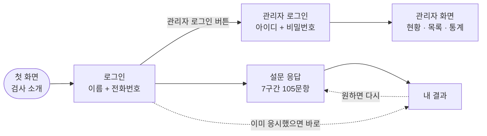
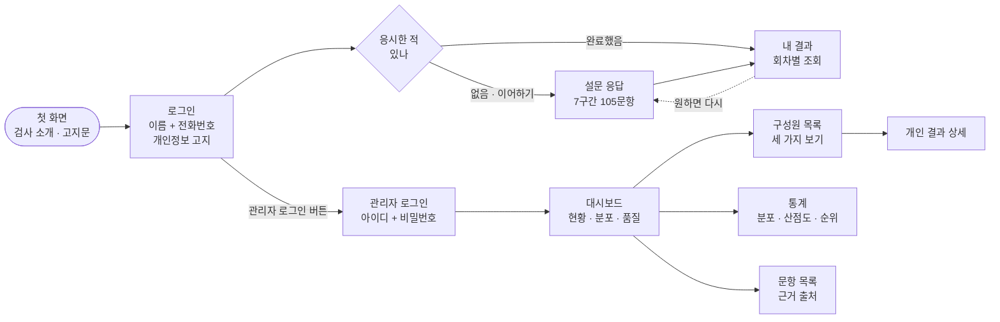
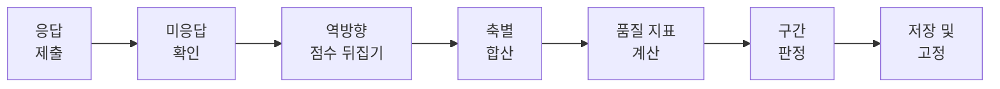
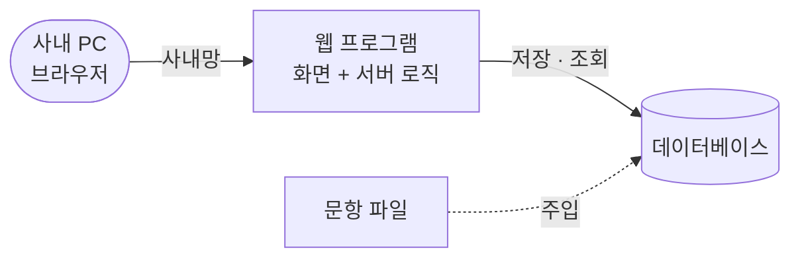
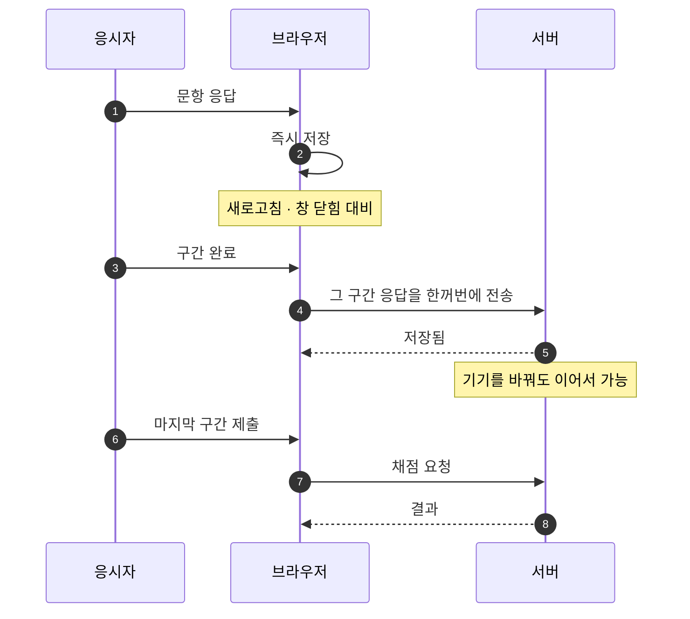
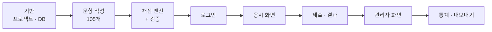

# 7차원 성향 설문 시스템 — 검토 보고

작성일 2026-08-21 · 개발 착수 전 검토용

---

# 1부. 요약

## 이렇게 만들려 합니다

구성원이 사내 웹사이트에서 105문항짜리 설문에 답하면, 본인은 자기 결과를 확인하고 대표님은 구성원별 결과와 전체 분포를 보실 수 있습니다. 응답 시간은 15분 안팎입니다.

사내 서버에서 돌아가며 외부 서비스는 쓰지 않습니다. 직접 만들고 회사 서버에 올리는 것이라 외부로 나가는 비용은 없습니다.

현재 설계는 끝났고 개발은 아직 시작하지 않았습니다.

## 화면이 이렇게 이어집니다

들어오는 문은 하나입니다. 구성원은 이름과 전화번호를 넣고 바로 시작하고, 관리자는 같은 화면에 있는 **관리자 로그인 버튼**을 눌러 아이디와 비밀번호로 들어갑니다. 관리자 계정은 미리 만들어둔 것만 쓸 수 있습니다.

## 설문은 이렇게 진행됩니다

구성원이 로그인하면 검사 안내를 먼저 보고, 105문항을 일곱 구간으로 나눠 응답합니다. 한 구간을 마칠 때마다 저장되기 때문에 중간에 그만두고 나중에 이어서 해도 됩니다. 다 답하고 제출하면 1초 안에 채점이 끝나고 곧바로 자기 결과를 봅니다.

## 응답이 결과가 되는 과정

문항 하나하나가 어느 축을 재는지 미리 정해져 있습니다. 응답을 축별로 모아 합산하면 축별 점수가 나오고, 축마다 문항 수가 달라 만점 대비 백분율로 환산해 표시합니다. 문항 중 삼사십 퍼센트는 방향이 반대인데, 한쪽으로 치우쳐 답하는 것을 막기 위한 것이라 채점할 때 점수를 뒤집습니다.

여기에 더해 응답이 성실했는지를 보는 지표를 함께 계산합니다. 문항당 응답 시간이 지나치게 짧거나, 서로 반대여야 정상인 문항 쌍에 같은 방향으로 답한 경우를 잡아냅니다. 성격에 대한 판정이 아니라 데이터를 믿을 수 있는지에 대한 판정입니다.

## 무엇을 재나

일곱 개 축으로 나눠 봅니다. 앞의 네 개는 타고난 기질에 가깝고, 뒤의 세 개는 경험을 통해 형성되는 성격에 가깝습니다.

| 기질 | 성격 |
|---|---|
| **자극추구** — 새로움에 끌리는 정도 | **자율성** — 스스로 정하고 책임지는 정도 |
| **위험회피** — 걱정하고 조심하는 정도 | **연대감** — 타인을 수용하고 협력하는 정도 |
| **사회적 민감성** — 타인 반응에 영향받는 정도 | **자기초월** — 자기를 넘어선 의미·연결감 |
| **인내력** — 보상 없이도 지속하는 힘 | |

결과 화면에는 일곱 축을 한꺼번에 보여주는 레이더 그래프와 축별 막대, 점수가 나옵니다.

## 관리자 권한으로 보실 수 있는 것

| | 사원 | 대표 |
|---|:---:|:---:|
| 설문 응답 | O | O |
| 본인 결과 보기 | O | O |
| **타인** 결과 보기 | **X** | O |
| 전체 현황·분포 보기 | X | O |

관리자 화면은 다섯 개입니다.

**대시보드**에서는 응시를 마친 인원과 진행 중인 인원을 먼저 봅니다. 그 아래에 회사 전체의 성향 분포가 나오는데, 축별 평균만이 아니라 **응답이 얼마나 퍼져 있는지**를 함께 보여줍니다. 평균이 비슷해도 어떤 축은 다들 비슷하게 답하고 어떤 축은 사람마다 극과 극일 수 있습니다.

**구성원 목록**은 같은 데이터를 세 가지 방식으로 봅니다. 전체를 작은 막대로 훑어보는 방식, 특정 축을 골라 높은 순·낮은 순으로 정렬해 보는 방식, 성향 조합이 비슷한 사람끼리 묶어 보는 방식입니다.

**개인 결과 상세**에서는 그 사람의 결과를 사원이 보는 것과 똑같이 보고, 여기에 더해 응답 품질과 사내 분포에서의 위치를 확인할 수 있습니다.

**통계**는 축 하나의 분포, 두 축의 조합, 축별 평균 순위 세 가지를 보여주고, **문항 목록**은 현재 나가는 문항과 그 근거 자료를 확인하는 화면입니다.

## 관리자 권한으로 하실 수 있는 것

데이터를 엑셀에서 볼 수 있는 파일로 내보낼 수 있습니다. 이름과 부서, 축별 점수, 응시일이 들어가고 전화번호는 빠집니다.

구성원을 삭제할 수 있습니다. 그 사람의 계정과 응답, 결과가 전부 지워지므로 퇴사자 정리에 씁니다. 되돌릴 수 없어서 확인할 때 이름을 직접 입력하게 해뒀습니다.

특정 구성원의 응시를 초기화할 수도 있습니다. 아무렇게나 찍고 제출한 것이 명백한 경우에 다시 받게 하는 용도입니다.

## 관리자 계정은 따로 관리합니다

관리자는 이름과 전화번호가 아니라 **아이디와 비밀번호**로 들어옵니다. 피해 규모가 다르기 때문입니다.

구성원 계정이 사칭되면 그 한 사람의 결과가 노출되는 데 그치지만, **관리자 계정이 넘어가면 전원의 결과와 삭제·내보내기 권한까지 함께 넘어갑니다.**

계정은 미리 만들어둔 것만 쓸 수 있고 스스로 가입할 수 없습니다. 다섯 번 틀리면 5분 동안 잠깁니다. 대표님도 별도 계정 없이 같은 계정으로 응시하고 본인 결과를 보실 수 있습니다.

## 아셔야 할 세 가지

**첫째, 공인된 심리검사가 아닙니다.** 공개된 논문과 자료를 근거로 직접 만든 도구입니다. 자기이해를 돕는 참고 자료 수준으로 보시면 됩니다.

**둘째, 로그인은 이름과 전화번호로 합니다.** 따로 가입하거나 비밀번호를 만들 필요가 없습니다. 다음에 같은 이름과 번호로 들어오면 예전에 받은 결과가 그대로 나오고, 원하면 거기서 다시 검사를 받을 수도 있습니다. 이전 결과는 지워지지 않고 날짜별로 남습니다.

**셋째, 신뢰성이 높지 않을 수 있습니다.** 공개된 논문과 자료를 최대한 근거로 삼아 문항을 만들지만, 이 문항들이 실제로 제대로 작동하는지는 응답이 쌓여봐야 알 수 있습니다. 응답이 모이면 문항별 품질을 확인해서 문제가 있는 것부터 교체합니다.

---
---

# 2부. 상세

1부 내용을 같은 순서로 조금 더 자세히 설명합니다.

## 1. 화면 구성

전체는 화면 열세 개입니다.

**로그인 화면은 하나입니다.** 구성원은 이름과 전화번호를 넣고 바로 시작하고, 관리자는 같은 화면 아래쪽 버튼으로 아이디·비밀번호 화면에 들어갑니다. 관리자용 주소를 따로 알려줄 필요가 없습니다.

개인정보 수집 고지도 이 화면에 붙어서, 무엇을 왜 받는지와 누가 볼 수 있는지를 그 자리에서 확인하고 시작합니다.

구성원 쪽은 로그인하면 새로 시작할지 이어서 할지가 자동으로 판단되고, 이미 마친 사람은 곧바로 결과 화면으로 갑니다. 관리자 쪽은 대시보드에서 출발해 나머지로 갈라지며 비밀번호 변경 화면이 하나 더 있습니다.

관리자 화면은 **주소를 직접 입력해도 서버에서 권한을 확인해 막습니다.**

## 2. 설문이 진행되는 방식

### 첫 화면

소요 시간과 문항 수, 중간에 그만두어도 이어서 할 수 있다는 점을 먼저 알려주고, 그 아래에 설문의 성격을 적습니다. 클로닝거의 기질·성격 이론을 참고해 사내에서 만든 도구이고 일곱 개 축으로 성향을 나눠 본다는 것, 정답과 오답이 없다는 것 정도입니다. 안내가 길면 읽지 않고 넘어가므로 짧게 씁니다.

### 응시 화면

105문항을 한 화면에 늘어놓으면 대부분 중간에 지쳐서 대충 답하게 됩니다. 이를 막기 위한 장치들이 들어갑니다.

문항은 척도별로 일곱 구간으로 나누고, 화면 위쪽에 진행 막대와 "섹션 3 / 7"을 고정해 둡니다. 구간별 문항 수는 12개에서 17개까지 조금씩 늘어나는데, 초반이 빠르게 차오르면 이탈이 줄어든다는 연구 결과를 따랐습니다.

한 화면에 여러 문항이 보이지만 **지금 답할 문항만 진하게** 표시되고 나머지는 흐려집니다. 답을 고르면 그 줄이 흐려지면서 다음 문항이 진해지고 화면이 부드럽게 내려갑니다. "다음" 버튼 없이 답하는 행위 자체가 진행이 됩니다.

응답은 일곱 단계로 받고 모든 항목에 글자 라벨을 붙입니다. 경과 시간은 표시하지 않고, 미응답은 구간을 넘길 때마다 확인해 다 끝내고 나서 찾으러 되돌아가는 일이 없게 합니다. 선택 상태는 색만이 아니라 굵기와 체크 표시로도 구분합니다.

이어하기는 두 겹입니다. 문항 하나하나는 브라우저에, 구간을 넘길 때는 서버에 저장됩니다. 브라우저를 닫거나 기기를 바꿔도 이어서 할 수 있고, 서른 날 넘게 방치된 응시는 자동으로 정리됩니다.

## 3. 채점

응답이 제출되면 서버에서 순서대로 처리합니다.

세 번째 단계가 가장 조심해야 하는 부분입니다. "나는 걱정이 많다"의 반대편에 "나는 웬만해선 걱정하지 않는다" 같은 문항을 섞어두고, 채점할 때 그 점수를 뒤집습니다. **이건 우리가 고안한 방식이 아니라 성격검사의 표준 관행입니다.** NEO-PI-R, Big Five 계열, 공개 문항은행인 IPIP까지 널리 쓰이는 검사들이 같은 방식을 쓰고 비율도 통상 30~40퍼센트 선이라 그대로 따랐습니다.

뒤집는 계산이 틀리면 결과가 통째로 반대로 나오면서도 화면상으로는 아무 문제 없어 보입니다. 그래서 채점 부분만 따로 떼어내 손으로 계산해둔 정답표와 대조하는 자동 검사를 붙입니다. 채점은 서버에서만 합니다.

반대로 **구간을 나누는 기준값은 유일하게 관행에 기댈 수 없는 부분입니다.** 정식 검사는 수천 명 표본으로 환산표를 만들지만 우리는 문항을 새로 썼기 때문입니다. 현재는 50퍼센트와 65퍼센트를 경계로 잡았는데, 일곱 단계에서 모두 중간값을 고르면 57퍼센트가 나오므로 그 사람이 "높은 편"으로 분류되지 않도록 맞춘 값입니다. 응답이 쌓이면 실제 분포를 보고 조정합니다.

## 4. 결과 화면

위쪽에 일곱 축을 한꺼번에 보여주는 레이더 그래프, 그 아래에 축별 막대와 점수가 나옵니다. 전체 모양은 레이더로, 축끼리 비교는 막대로 봅니다. 축 이름 옆 아이콘을 누르면 그 축이 무엇을 재는지 설명이 뜨고, 화면 아래쪽에는 사내 자체 제작 도구라는 안내가 상시 표시됩니다.

"상위 몇 퍼센트" 같은 사내 순위와 세부 항목 점수는 개인 화면에 넣지 않습니다. 한 번 나온 결과는 확정된 값을 그대로 보관하므로 응시자가 늘어도 바뀌지 않습니다. 1차 버전은 그래프와 점수, 축 설명까지만 내고 개인별 맞춤 해설은 2차로 미뤘습니다.

**다시 검사받기** — 결과 화면 아래 버튼으로 원할 때 언제든 다시 받을 수 있습니다. 이전 결과는 지우지 않고, 화면 위쪽에서 응시 날짜를 골라 예전 것을 그대로 볼 수 있습니다. 다만 두 회차를 겹쳐 그려 비교해주는 기능은 1차에 넣지 않았습니다.

## 5. 관리자가 보는 화면

관리자 화면은 집계하고 정렬하고 그려서 보여주는 데까지만 합니다. "이 사람은 특이하다" 같은 판정은 넣지 않았습니다. 유일한 예외가 응답 품질 표시인데, 성격에 대한 판정이 아니라 데이터를 믿을 수 있는지에 대한 것입니다.

### 대시보드

맨 위에 응시를 마친 인원과 진행 중인 인원이 나옵니다. 계정이 로그인할 때 만들어지는 구조라 아직 들어오지 않은 사람은 집계에 잡히지 않습니다. "전 직원 중 몇 명"이 아니라 "지금까지 몇 명이 마쳤는지"를 보는 숫자입니다.

그 아래에 사내 평균 레이더와 축별 퍼짐 정도가 나란히 표시됩니다. 평균이 비슷한 두 축이라도 한쪽은 다들 비슷하게 답했고 다른 쪽은 극과 극일 수 있는데, "우리 회사가 어떤 성향이냐"의 답은 그 차이에 있습니다. 가장 모인 축과 가장 갈리는 축을 자동으로 짚어줍니다.

응시 진행 중에는 날짜별 완료 인원이 꺾은선으로 함께 나오고, 응답 품질이 의심스러운 건수도 여기서 요약합니다. 응답이 어느 정도 쌓이면 검사 품질 지표가 활성화되어 기준에 못 미치는 축을 짚어줍니다.

### 구성원 목록

화면 하나에서 보기 방식만 바꿔 세 가지 관점으로 봅니다.

**훑어보기**는 이름·상태·응시일과 함께 일곱 축 점수를 작은 막대로 보여줍니다. 숫자표는 잘 읽히지 않지만 막대는 훑으면 패턴이 눈에 들어옵니다. 축 이름을 누르면 그 축 기준으로 정렬되어 위쪽이 곧 그 성향이 두드러진 사람들입니다.

**사내 분포에서의 위치**는 축 하나를 골라 히스토그램과 평균·표준편차를 보고, 그 아래 높은 순·낮은 순으로 이름이 나열됩니다. 순위 번호는 붙이지 않습니다.

**유형별 보기**는 기질 쪽 세 축의 높고 낮음 조합으로 여덟 칸을 만들어 사람을 배치합니다. 성격 쪽 세 축은 별도 탭입니다. 유형에 이름은 붙이지 않고 조합 표기만 쓰며, 칸당 몇 명 수준이라 훑어보는 용도입니다.

부서별 필터는 넣지 않았습니다. 부서당 인원이 적어 통계가 성립하지 않고, 필터를 거는 것 자체가 개인을 특정하는 일이 됩니다.

### 개인 결과 상세

사원이 보는 것과 같은 그래프와 점수가 먼저 나오고, 아래에 관리자만 보는 정보가 붙습니다. 응답 품질(평균 응답 시간, 반대 문항 일치도, 응답 변경 횟수)과 사내 분포에서의 위치입니다. 레이더에는 사내 평균이 점선으로 겹쳐 그려져 어느 축이 평균에서 벗어나 있는지가 바로 읽힙니다.

응시 이력이 여러 건이면 날짜를 골라 과거 결과를 볼 수 있고, 목록과 분포 계산에는 가장 최근 결과를 씁니다.

### 통계

구성원 목록의 두 번째 보기가 "누가 높고 낮은가"라는 사람 중심이라면, 이 화면은 "데이터가 어떤 모양인가"라는 데이터 중심입니다.

**축별 분포**는 축 하나의 점수 분포를 히스토그램으로 봅니다. **두 축 비교**는 축 두 개를 골라 사람들을 좌표에 흩뿌려 두 성향의 조합을 눈으로 찾을 때 쓰고, 점을 누르면 그 사람 상세로 넘어갑니다. **축별 평균 순위**는 일곱 축을 평균 높은 순으로 정렬해 "우리 회사는 연대감이 높고 위험회피가 낮은 편"을 한눈에 보여줍니다.

두 축 비교에서 상관계수나 추세선은 표시하지 않습니다. "두 축이 관련 있다"는 추론은 쉰 명 규모에서 자주 틀리지만 "이 사람들이 여기 있다"는 사실은 표본과 무관하게 정확하기 때문입니다.

### 문항 목록

현재 나가는 문항을 구간별로 묶어 보여줍니다. 문항 내용과 어느 축인지, 방향이 반대인지, **어떤 자료를 근거로 만들었는지**가 함께 나옵니다. 마지막 항목이 이 화면의 이유입니다 — 저작권 대응이 말로만 끝나지 않으려면 문항이 어디서 나왔는지 언제든 확인할 수 있어야 합니다. 읽기 전용이고, 문항 수정은 화면이 아니라 파일에서 합니다.

## 6. 관리자가 하는 조작

**데이터 내보내기** — 이름과 부서, 축별 점수, 응시일, 소요 시간, 품질 표시가 파일로 나옵니다. 화면과 파일이 어긋나지 않도록 두 곳이 같은 조회 경로를 씁니다.

**응시 초기화** — 특정 구성원의 응답과 결과를 지워 다시 응시할 수 있게 합니다. 계정은 남습니다. 구성원 본인도 스스로 다시 받을 수 있으므로 필수는 아니지만, 관리자가 대신 정리해줘야 할 때를 위해 남겨둡니다.

**구성원 삭제** — 퇴사자나 오타로 만들어진 계정을 정리합니다. 계정과 응답, 결과, 이력이 전부 지워지고 되돌릴 수 없어서 확인 창에서 **대상자 이름을 직접 입력해야** 실행됩니다. 관리자 계정은 삭제할 수 없게 막았습니다 — 마지막 관리자를 지우면 아무도 들어갈 수 없게 되기 때문입니다.

초기화는 응답만 지우고 계정을 남기는 것이고 삭제는 계정 자체를 없애는 것이라, 두 버튼이 나란히 보이는 만큼 문구를 확실히 구분했습니다.

## 7. 로그인과 계정

**관리자**는 아이디와 비밀번호로 들어옵니다. 비밀번호는 원문을 저장하지 않고 되돌릴 수 없는 형태로 보관합니다. 계정은 설치할 때 하나 만들어두고 그 뒤로는 화면에서 만들 수 없습니다. 다섯 번 틀리면 5분 동안 잠기고, 틀렸을 때 아이디가 틀렸는지 비밀번호가 틀렸는지는 알려주지 않습니다. 비밀번호를 바꿀 때는 현재 비밀번호를 함께 물어봅니다.

**구성원**은 이름과 전화번호만 입력합니다. 가입 절차가 없어서 처음 들어온 사람도 그 자리에서 계정이 만들어집니다. 명단을 미리 준비할 필요가 없고 신규 입사자가 와도 등록해줄 일이 없습니다. 대신 오타로 잘못 입력하면 엉뚱한 계정이 생기는데, 목록에서 눈에 띄면 지우는 방식으로 정리합니다.

전화번호는 `010-1234-5678`과 `01012345678`을 같은 것으로 처리합니다. 이걸 빠뜨리면 하이픈 유무 때문에 같은 사람이 못 들어오는 일이 생깁니다. 같은 이름과 번호로 5분 안에 열 번 실패하면 5분 동안 잠기는데, 사무실이 인터넷 주소를 함께 쓰므로 주소가 아니라 이름·번호 조합 단위로 막습니다.

## 8. 데이터와 권한

저장하는 것은 이름과 전화번호, 부서, 문항별 응답과 응답에 걸린 시간, 축별 점수와 응시 일시입니다. 주민등록번호나 주소, 이메일은 받지 않습니다. 구성원 계정에는 비밀번호가 없고 관리자 비밀번호만 되돌릴 수 없는 형태로 보관합니다. 이 내용은 로그인 화면에서 함께 고지하며, 보관 기간 문구만 비워뒀습니다.

퇴사자 데이터는 자동 삭제 주기를 두지 않고 관리자가 필요할 때 직접 지웁니다. 권한 확인은 서버에서 하며, 본인 결과를 불러오는 통로에는 아예 "누구 것"이라는 값을 받지 않아 남의 것을 요청할 방법 자체가 없습니다.

다만 구성원 쪽의 이름과 전화번호는 식별은 되지만 인증은 아닙니다. 사내에서 둘 다 비밀이 아니라 동료 사칭을 구조적으로 막지 못합니다. 비밀번호를 도입하면 막히지만 그만큼 번거로워져 간편함을 우선했습니다.

**남은 위험의 범위는 한정적입니다.** 관리자 계정에 비밀번호가 걸려 있어 "한 사람이 전원의 데이터를 가져가거나 지우는" 상황은 막힙니다. 남는 것은 "동료가 동료 한 명의 결과를 보는" 경우이고, 여기에 사내 서버 배포와 반복 시도 차단이 더해집니다.

나중에 구성원 쪽도 강화가 필요해지면 로그인 부분만 갈아끼우면 됩니다.

### 데이터 백업

서버 한 대에 데이터베이스 하나를 두는 구조라, 서버가 고장 나면 전원의 응답과 결과가 함께 사라집니다. 그래서 백업을 두 겹으로 둡니다.

**자동 백업**은 하루 한 번 데이터베이스 전체를 파일로 떠서 서버 안에 보관하고 최근 열네 개만 남깁니다. **관리자가 직접 내려받는 백업**은 버튼을 누르면 그 시점 파일이 만들어집니다. 자동 백업만 있으면 서버가 죽을 때 백업도 함께 사라지므로, **파일을 서버 밖에 둘 수 있어야 실제 방어가 됩니다.**

백업 파일에는 모든 원본이 들어 있어 안전한 보관을 당부하는 안내를 함께 띄웁니다. 복구 버튼은 화면에 두지 않고 절차를 운영 문서에 적어둡니다.

## 9. 무엇으로 만드나

사내 서버에 프로그램 하나와 데이터베이스 하나를 띄우고, 사내망 PC에서 브라우저로 접속합니다. 외부와 주고받는 것은 없습니다.

| 무엇 | 왜 |
|---|---|
| Next.js + TypeScript | 화면과 서버 로직을 한 프로젝트에서. 타입 검사가 채점 관련 실수를 미리 잡아줍니다 |
| PostgreSQL | 사내에서 직접 운영할 수 있고 라이선스 비용이 없습니다 |
| Docker | 서버를 옮길 때 환경 차이로 생기는 문제를 없앱니다 |

### 문항은 파일로 관리합니다

문항을 프로그램 코드가 아니라 별도 파일에 둡니다. 고칠 때 프로그램을 건드리지 않아도 되고, 무엇을 언제 왜 바꿨는지가 파일 이력으로 남으며, 근거 자료도 같은 파일에 적힙니다. 주입 전에는 형식 검사를 거쳐 근거 출처 누락이나 짝이 안 맞는 문항을 걸러냅니다.

문항을 교체할 때는 지우지 않고 "물러난 문항"으로 표시만 바꿉니다. 지우면 그 문항에 답한 과거 응답이 갈 곳을 잃습니다. 문항을 바꿔도 이미 응시한 사람에게 다시 하라고 하지 않습니다. 기존 결과는 그대로 유지되고 개정 이후 응시자만 새 문항으로 채점됩니다.

### 응답을 잃어버리지 않게

15분짜리 설문에서 응답이 날아가면 다시 하지 않습니다. 그래서 두 겹으로 저장합니다.

문항마다 서버로 보내면 105번 왕복해야 하므로 구간이 끝날 때 일곱 번만 보냅니다.

### 그 밖에

**채점은 따로 떼어냅니다.** 데이터베이스나 화면과 관계없이 혼자 돌아가야 정답표와 자동으로 대조할 수 있습니다.

**결과는 고정합니다.** 채점이 끝난 시점의 값을 따로 저장하고 이후 화면에는 저장본을 보여줍니다.

**화면 폭은 고정하지 않습니다.** 배율을 키워 쓰면 브라우저가 인식하는 폭이 좁아지기 때문입니다. 모바일은 후순위지만 구조만 열어둡니다.

## 10. 어떻게 만드나

### 데이터를 어떻게 나눠 저장하나

네 갈래입니다.

**사람** — 이름과 전화번호, 부서, 권한. 관리자면 로그인 정보도 여기 붙습니다.

**검사 내용** — 문항 묶음의 버전과 문항 하나하나, 각 문항의 축·방향·근거 자료.

**응답** — 누가 언제 어느 버전으로 응시했고 문항마다 뭐라 답했는지.

**결과** — 축별 점수와 확정본, 그리고 품질 지표.

**문항별 응답을 전부 남기는 것이 중요합니다.** 결과만 저장하면 간단해 보이지만 채점을 다시 할 수 없고 문항 품질도 확인할 수 없습니다. 문항이 제대로 작동하는지 보려면 개인별·문항별 응답이 있어야 하고 축별 총점만으로는 계산되지 않습니다. **결과는 응답에서 다시 만들 수 있지만 응답은 잃으면 끝입니다.**

다만 관리자 화면에서 개인의 문항별 응답을 보여주지는 않습니다. 문항 분석은 전체를 묶은 집계로만 봅니다.

### 무엇을 자동으로 검증하나

사람이 눈으로 확인하기 어려운 것들만 골라 자동 검사를 붙입니다.

**채점 정확성**이 가장 중요합니다. 전 문항에 중간값을 답했을 때와 정방향 최고점·역방향 최저점을 답했을 때 어떤 점수가 나와야 하는지를 대조하면, 역방향 처리가 뒤집혔을 때 여기서 걸립니다.

**문항 파일 형식**도 검사합니다 — 문항 수, 근거 출처 누락, 반대 방향 문항 짝, 역방향 비율. 응답 품질 계산과 화면 동작도 검사 대상입니다.

### 만드는 순서

**문항 작성이 두 번째**인 것은 채점 엔진 검증에 실제 문항이 필요하고, 사람이 읽고 검토해야 하는 유일한 산출물이라 시간이 가장 오래 걸리기 때문입니다. **응시 화면은 관리자 화면보다 먼저** 만듭니다. 기술적으로 가장 까다로워서 여기서 막히면 설계를 바꿔야 하는데, 나중에 발견하면 이미 만든 것이 많아집니다.

개발은 각자 PC에서 하고 완성되면 사내 서버로 옮겨 명령 한 번으로 띄웁니다. 서버마다 달라지는 값은 코드에 적지 않고 환경 설정으로 뺍니다.

## 11. 왜 기존 검사를 쓰지 않는가

정식 TCI는 한국 판권이 마음사랑에 있어 문항과 결과지를 그대로 쓸 수 없고, MBTI 같은 것은 유형 라벨링 방식이라 사내에서 "너는 무슨 형"으로 굳어질 위험이 있습니다. 구글폼 같은 설문 서비스는 자동 채점·개인별 그래프·권한 분리가 안 되고 데이터가 외부에 저장됩니다.

그래서 공개된 논문과 공개 문항은행을 근거로 직접 만들기로 했습니다. 이론적 뿌리는 클로닝거의 기질·성격 모델인데, 이론과 학술 용어는 자유롭게 참고할 수 있고 보호되는 것은 제품 이름과 실제 문항이라 검사 이름도 `7차원 성향 설문`으로 정했습니다.

## 12. 한계

**문항을 사전 검증하지 못합니다.** 원래는 스무 명에서 서른 명 규모로 미리 검증한 뒤 배포하는 것이 순서인데, 전체가 쉰 명 이내라 그러면 본 검사에 남는 표본이 없어집니다. 같은 사람을 두 번 시키면 기억 때문에 두 번째가 오염되고요. 그래서 운영하면서 검증하고 신뢰도가 낮은 축부터 문항을 교체합니다.

**표본이 작습니다.** 쉰 명 이내라 사내 평균과 분포는 참고 수준으로만 봐야 하고, 응답이 일정 수준에 못 미치면 분포 표시가 나오지 않습니다. 개인에게 일곱 개 축까지만 보여주는 것도 같은 이유입니다.

---

상세 설계는 `00_설계_작업본.md`와 `01_기능_UX_설계.md`에 있습니다.
